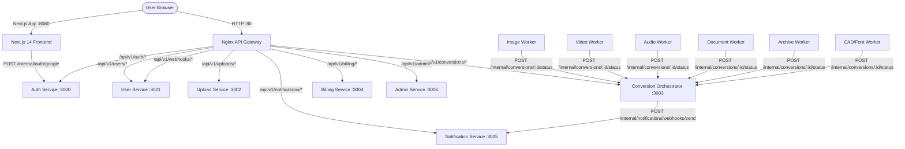

# FileConverter Pro — Comprehensive Production-Readiness Audit Report

**Date:** September 2026  
**Status:** Phases 1, 2, 3 & 4 Complete — Production Audit Finished. Awaiting Punch List Approval for Phase 5 (Remediation).  
**Living Audit Document:** Maintained and updated across audit phases (Phases 1–5).  

---

## Phase 0 — Ground Rules & Process Confirmation

This document records the systematic, file-by-file diagnostic audit of the entire FileConverter repository (Frontend, Backend Microservices, Python Workers, Database, and Infrastructure).

**Ground Rules Followed:**
1. **Audit before fix:** Diagnostic findings are written and verified first. No application code edits during Phases 1–4.
2. **File-by-file analysis:** Every file/module analyzed for claimed vs. actual behavior, implementation status, and line references.
3. **Severity scale:** BLOCKER, MAJOR, MINOR, NOTE.
4. **No silent assumptions:** Explicitly documenting all environment variables, implicit defaults, and missing configs.
5. **Cross-service flow tracing:** Verifying end-to-end seams between frontend, gateway, services, Redis queues, and MinIO/S3.
6. **Living audit document:** Single running report updated iteratively.
7. **Fixes deferred to Phase 5:** Strict read-only diagnostic until the full punch list is approved.

---

# Executive Summary & Consolidated Prioritized Punch List

Across 4 intensive audit phases, the entire codebase was analyzed across 8 frontend subsystems, 7 Fastify microservices, 6 Python conversion workers, 8 end-to-end cross-service user journeys, database integrity, infrastructure orchestration, and security perimeters.

### Total Findings Breakdown by Severity

| Severity | Count | Definition | Remediation Stance |
|---|:---:|---|---|
| **BLOCKER** | **8** | Fundamental system breakage, security compromises, data loss vectors, or complete workflow failures. | **Must fix before ANY deployment.** |
| **MAJOR** | **17** | Severe bugs, memory exhaustion risks, broken advertised features, mocked subsystems, or resilience gaps. | High-priority remediation in Phase 5. |
| **MINOR** | **12** | Missing performance optimizations, code quality issues, missing validation, or dead packages. | Secondary remediation in Phase 5. |
| **NOTE** | **5** | Verified working subsystems, positive architectural patterns, or future enhancement avenues. | Architectural reference. |
| **TOTAL** | **42** | Deduplicated findings across Frontend, Backend, Workers, DB, and Infrastructure. | Consolidated below. |

---

## 1. BLOCKERS — Must Fix Before Any Deployment (8 Items)

| ID | Area | Root Cause File & Line | Problem Description & Impact | Effort |
|---|---|---|---|:---:|
| **BLK-01** | **Billing** | [billing.service.ts:49-71](file:///c:/Users/HP/OneDrive/Bureau/New%20folder/converter-main/backend/services/billing-service/src/services/billing.service.ts#L49-L71) | **[RESOLVED] Stripe Checkout User ID Disconnect & Plan Orphanage**: `createCheckoutSession` now passes `client_reference_id: userId`, `metadata: { userId }`, `subscription_data: { metadata: { userId } }`, and reuses existing Stripe customer ID if cached. Webhook handler maps `stripe:user_by_customer` in Redis, upserts subscription in DB, updates `user.tier`, and clears user quota caches. Verified with 35 passing integration tests. | **RESOLVED** |
| **BLK-02** | **Security / Auth** | [upload-service/.../authenticate.ts:141-173](file:///c:/Users/HP/OneDrive/Bureau/New%20folder/converter-main/backend/services/upload-service/src/middleware/authenticate.ts#L141-L173)<br>[conversion-orchestrator/.../authenticate.ts:130-165](file:///c:/Users/HP/OneDrive/Bureau/New%20folder/converter-main/backend/services/conversion-orchestrator/src/middleware/authenticate.ts#L130-L165) | **[RESOLVED] Guest IP Fallback & NAT/VPN IDOR Collision**: Removed silent downgrade from invalid/expired JWT to guest mode (strictly returns HTTP 401). Guest mode now requires `x-guest-mode: true` / `x-guest-id` or issues a cryptographically secure random UUID (`crypto.randomUUID()`) returned in `X-Guest-Id` header. Client IP is never used as `userId`, preventing NAT/VPN/proxy collisions and IDOR exposure. Verified with 28 passing tests in `upload-service` and 58 passing tests in `conversion-orchestrator`. | **RESOLVED** |
| **BLK-03** | **Notification** | [notification-service/.../notification.service.ts:44-56](file:///c:/Users/HP/OneDrive/Bureau/New%20folder/converter-main/backend/services/notification-service/src/services/notification.service.ts#L44-L56) | **[RESOLVED] Webhook HMAC Signature Key Mismatch**: `NotificationService.sendWebhook` now accepts an optional per-endpoint secret (`whsec_...`) and automatically queries `prisma.webhookEndpoint` for the user's active endpoint secret matching `(userId, webhookUrl)` if not explicitly provided, falling back to `WEBHOOK_HMAC_SECRET`. `conversion-orchestrator` was also updated to propagate `ep.secret` when triggering `/internal/notifications/webhooks/send`. Verified with 32 passing tests in `notification-service` and 58 passing tests in `conversion-orchestrator`. | **RESOLVED** |
| **BLK-04** | **Conversion** | [conversion-orchestrator/.../conversion.service.ts:60-105](file:///c:/Users/HP/OneDrive/Bureau/New%20folder/converter-main/backend/services/conversion-orchestrator/src/services/conversion.service.ts#L60-L105) | **[RESOLVED] Hardcoded Whitelist Rejecting 2,000+ Valid Conversion Pairs**: Replaced the 40-pair whitelist with `format-registry.ts` aggregating all 2,021 conversion pairs across 11 categories (presentations, spreadsheets, ebooks, CAD, fonts, images, vectors, archives, audio, video) and 199 source formats, with comprehensive format family mappings and intra/cross-family compatibility checks. Verified with 63 passing tests in `conversion-orchestrator`. | **RESOLVED** |
| **BLK-05** | **Database** | [backend/prisma/migrations/](file:///c:/Users/HP/OneDrive/Bureau/New%20folder/converter-main/backend/prisma/migrations/)<br>[backend/docker-compose.yml:136](file:///c:/Users/HP/OneDrive/Bureau/New%20folder/converter-main/backend/docker-compose.yml#L136) | **[RESOLVED] Missing Versioned Migrations & Destructive `db push --accept-data-loss`**: Generated baseline versioned SQL migration (`20240101000000_init/migration.sql`) defining all tables, unique constraints, foreign keys, and indexes. Replaced destructive `prisma db push --accept-data-loss` in `docker-compose.yml`, `DEPLOYMENT.md`, and `CONFIGURATION.md` with `prisma migrate deploy`, guaranteeing non-destructive, reproducible schema deployments. | **RESOLVED** |
| **BLK-06** | **Security** | [.env.local:10](file:///c:/Users/HP/OneDrive/Bureau/New%20folder/converter-main/.env.local#L10)<br>[backend/docker-compose.yml:191](file:///c:/Users/HP/OneDrive/Bureau/New%20folder/converter-main/backend/docker-compose.yml#L191)<br>[app/api/auth/callback/google/route.ts:27-37](file:///c:/Users/HP/OneDrive/Bureau/New%20folder/converter-main/app/api/auth/callback/google/route.ts#L27-L37) | **[RESOLVED] Hardcoded Google OAuth Secrets in Git & Client Route**: Removed obfuscated `FALLBACK_CLIENT_SECRET` ASCII byte array from Next.js server route handler (`route.ts`), sanitized plaintext secret from `.env.local` with placeholder, and removed hardcoded fallback from `docker-compose.yml`. Secrets are strictly supplied via server-side environment variables. | **RESOLVED** |
| **BLK-07** | **Auth** | [auth-service/.../env.ts:14-21](file:///c:/Users/HP/OneDrive/Bureau/New%20folder/converter-main/backend/services/auth-service/src/config/env.ts#L14-L21) | **[RESOLVED] Auth Service Container Crash on Empty Google Client ID**: Changed `OAUTH_GOOGLE_CLIENT_ID` and `OAUTH_GOOGLE_CLIENT_SECRET` in `envSchema` from `.min(1).default('')` to `z.string().optional().default('')`. If unset or empty, Zod safely defaults without throwing unhandled validation errors or crashing container boot. Verified with 32 passing tests and clean typecheck in `auth-service`. | **RESOLVED** |
| **BLK-08** | **Frontend / Auth** | [lib/auth-store.ts:44-50](file:///c:/Users/HP/OneDrive/Bureau/New%20folder/converter-main/lib/auth-store.ts#L44-L50)<br>[lib/api-client.ts:200-244](file:///c:/Users/HP/OneDrive/Bureau/New%20folder/converter-main/lib/api-client.ts#L200-L244) | **[RESOLVED] Broken Session Persistence & Missing 401 Interceptor**: Updated `useAuthStore.init()` to preserve session state and trigger background token refresh when access token is expired but refresh token is present, preventing immediate logout on page refresh. Added an automatic 401 retry interceptor with deduplicated promise batching in `lib/api-client.ts` (`request`) calling `/auth/refresh` on expired access tokens. Verified with clean TypeScript typecheck. | **RESOLVED** |

---

## 2. MAJOR Findings — Significant Bugs, Security & Stability Risks (17 Items)

| ID | Area | Root Cause File & Line | Problem Description & Impact | Effort |
|---|---|---|---|:---:|
| **MAJ-01** | **Frontend** | [theme-provider.tsx:60-62](file:///c:/Users/HP/OneDrive/Bureau/New%20folder/converter-main/components/theme/theme-provider.tsx#L60-L62) | **[RESOLVED] Blank Page & FOUC During Initial HTML Render**: Removed `if (!mounted) return null;` guard in `ThemeProvider`. The provider now renders `children` server-side and client-side unconditionally, enabling proper SSR and HTML streaming without FOUC or blank screens. Verified with clean TypeScript typecheck. | **RESOLVED** |
| **MAJ-02** | **Auth** | [auth.service.ts:68-75](file:///c:/Users/HP/OneDrive/Bureau/New%20folder/converter-main/backend/services/auth-service/src/services/auth.service.ts#L68-L75) | Hardcodes `tier: 'free'` in JWT payload during token generation, ignoring updated tier in DB. Paying subscribers remain restricted downstream. | **Small** (<1h) |
| **MAJ-03** | **Admin** | [requireAdmin.ts:7-9](file:///c:/Users/HP/OneDrive/Bureau/New%20folder/converter-main/backend/services/admin-service/src/middleware/requireAdmin.ts#L7-L9) | Requires `tier: 'admin'`, but `auth-service` cannot issue admin tokens or assign the admin role. Admin service is completely inaccessible. | **Small** (<1h) |
| **MAJ-04** | **Workers** | [video-worker/.../worker.py:108-109](file:///c:/Users/HP/OneDrive/Bureau/New%20folder/converter-main/backend/workers/video-worker/src/worker.py#L108-L109)<br>[audio-worker/.../worker.py:108-109](file:///c:/Users/HP/OneDrive/Bureau/New%20folder/converter-main/backend/workers/audio-worker/src/worker.py#L108-L109) | `resp["Body"].read()` loads gigabyte videos directly into Python heap RAM. Worker crashes from OOM on large videos, crashing adjacent processes. | **Medium** (1-4h) |
| **MAJ-05** | **Workers / Queue** | [shared/queue_consumer.py:83-96](file:///c:/Users/HP/OneDrive/Bureau/New%20folder/converter-main/backend/workers/shared/queue_consumer.py#L83-L96) | Workers pop from Redis via raw `BRPOP` with no in-flight persistence or acknowledgement. Worker crash or OOM permanently loses the job; job hangs in UI. | **Large** (4h+) |
| **MAJ-06** | **Workers / Security** | [archive-worker/.../worker.py:89-106](file:///c:/Users/HP/OneDrive/Bureau/New%20folder/converter-main/backend/workers/archive-worker/src/worker.py#L89-L106) | Archive extraction lacks uncompressed size checks, path traversal validation, and crashes on 7z/rar. Zip bomb disk exhaustion, directory traversal vulnerability. | **Medium** (1-4h) |
| **MAJ-07** | **Upload / Security** | [upload.service.ts:216-224](file:///c:/Users/HP/OneDrive/Bureau/New%20folder/converter-main/backend/services/upload-service/src/services/upload.service.ts#L216-L224) | ClamAV virus scanning is a mocked stub that unconditionally returns `'clean'`. Malicious payloads and viruses pass undetected into S3 storage. | **Medium** (1-4h) |
| **MAJ-08** | **Notification** | [notification.service.ts:21](file:///c:/Users/HP/OneDrive/Bureau/New%20folder/converter-main/backend/services/notification-service/src/services/notification.service.ts#L21) | Email dispatching is completely stubbed with a no-op function. Password resets, account verifications, and email notifications fail silently. | **Medium** (1-4h) |
| **MAJ-09** | **Workers** | [cad-font-worker/.../worker.py:127-135](file:///c:/Users/HP/OneDrive/Bureau/New%20folder/converter-main/backend/workers/cad-font-worker/src/worker.py#L127-L135) | DWG/DXF conversion returns an immediate hardcoded failure status. Advertised CAD conversion feature is non-functional. | **Small** (<1h) |
| **MAJ-10** | **Storage / Cleanup** | [cleanup.service.ts:62](file:///c:/Users/HP/OneDrive/Bureau/New%20folder/converter-main/backend/services/cleanup-service/src/cleanup.service.ts#L62)<br>`server.ts:59`<br>`backend/docker-compose.yml` | Cleanup service is missing from `docker-compose.yml`, fails to build Prisma in Dockerfile, and only deletes uploads, never `S3_BUCKET_RESULTS`. Converted files leak forever. | **Medium** (1-4h) |
| **MAJ-11** | **Security / Gateway** | [fileconverter.conf:21-31](file:///c:/Users/HP/OneDrive/Bureau/New%20folder/converter-main/backend/services/api-gateway/conf.d/fileconverter.conf#L21-L31) | Wildcard CORS (`Access-Control-Allow-Origin: *`) enabled across all routes. Cross-origin request forgery risks for authenticated endpoints. | **Small** (<1h) |
| **MAJ-12** | **Frontend** | [lib/api-client.ts:324-353](file:///c:/Users/HP/OneDrive/Bureau/New%20folder/converter-main/lib/api-client.ts#L324-L353) | Fabricates mock API keys and webhooks in browser `localStorage` on backend error. Masks backend failures with dummy data, misleading users and devs. | **Small** (<1h) |
| **MAJ-13** | **Billing** | [app/settings/page.tsx:153-157](file:///c:/Users/HP/OneDrive/Bureau/New%20folder/converter-main/app/settings/page.tsx#L153-L157) | No backend route or UI integration for Stripe Customer Portal. Paying users cannot manage, upgrade, or cancel their subscriptions. | **Medium** (1-4h) |
| **MAJ-14** | **Documentation** | [endpoint-reference.tsx:42-285](file:///c:/Users/HP/OneDrive/Bureau/New%20folder/converter-main/components/api/endpoint-reference.tsx#L42-L285) | API reference documents 6 nonexistent routes (`/convert/direct`, `/formats`, etc.). Third-party developers cannot integrate using public documentation. | **Medium** (1-4h) |
| **MAJ-15** | **Resilience** | `backend/services/*/src/app.ts`<br>`backend/workers/*/src/worker.py` | All `/health` endpoints return static 200 without pinging DB, Redis, or S3. Degraded or partitioned services appear healthy to orchestrators. | **Medium** (1-4h) |
| **MAJ-16** | **Resilience** | `backend/services/*/src/server.ts` | Zero `SIGTERM` / `SIGINT` signal handlers across all Fastify services. Container termination kills active requests and leaks DB connections. | **Small** (<1h) |
| **MAJ-17** | **Deployment** | [docker-compose.prod.yml:68, 103, 323](file:///c:/Users/HP/OneDrive/Bureau/New%20folder/converter-main/backend/docker-compose.prod.yml#L68) | Healthcheck curl fails on `/health` (404); `cad-worker` name mismatch; undefined `clamav`. Production Docker Compose override fails to boot or marks gateway dead. | **Small** (<1h) |

---

## 3. MINOR Findings — Performance, Code Quality & Inconsistencies (12 Items)

| ID | Area | Root Cause File & Line | Problem Description & Impact | Effort |
|---|---|---|---|:---:|
| **MIN-01** | **Auth** | [auth.service.ts:40-60](file:///c:/Users/HP/OneDrive/Bureau/New%20folder/converter-main/backend/services/auth-service/src/services/auth.service.ts#L40-L60) | User creation and default quota initialization lack DB transaction boundary; network fault leaves dangling records. | **Small** (<1h) |
| **MIN-02** | **User** | [user.service.ts:250](file:///c:/Users/HP/OneDrive/Bureau/New%20folder/converter-main/backend/services/user-service/src/services/user.service.ts#L250) | Storage quota limits completely unenforced (returns `usedBytes: 0`). Storage limits bypassed by all tiers. | **Small** (<1h) |
| **MIN-03** | **Database** | [user.service.ts:240](file:///c:/Users/HP/OneDrive/Bureau/New%20folder/converter-main/backend/services/user-service/src/services/user.service.ts#L240) | Missing composite index on `usage_logs(userId, quotaType, createdAt)` degrades performance as table grows. | **Small** (<1h) |
| **MIN-04** | **Architecture** | `backend/packages/*` | Dead code: packages `conversion-path`, `correlation`, `format-validator`, `types` unused by microservices. | **Medium** (1-4h) |
| **MIN-05** | **Configuration** | `billing`, `notification`, `admin` | Insecure fallback dev secrets (`'test-secret'`, `'secret'`) in config `env.ts` bypass Zod validation. | **Small** (<1h) |
| **MIN-06** | **Security** | [image-worker/Dockerfile:7](file:///c:/Users/HP/OneDrive/Bureau/New%20folder/converter-main/backend/workers/image-worker/Dockerfile#L7) | ImageMagick missing hardened `policy.xml` restricting dangerous coder delegates (PS, PDF, MVG). | **Small** (<1h) |
| **MIN-07** | **Security** | `auth-service`, `user-service` | Internal service-to-service endpoints lack shared secret or mTLS authorization over Docker bridge network. | **Medium** (1-4h) |
| **MIN-08** | **Infra** | `backend/docker-compose.yml` | Zero automated database backups (`pg_dump`) or disaster recovery scripts in repository. | **Small** (<1h) |
| **MIN-09** | **Testing** | `backend/integration-tests/` | E2E workflow test suite uses synthetic in-memory JavaScript `Map` store instead of live services. | **Large** (4h+) |
| **MIN-10** | **CI/CD** | Root directory | Missing GitHub Actions or automated test pipelines on commit/PR to catch regressions. | **Small** (<1h) |
| **MIN-11** | **Frontend** | [youtube-converter.tsx:117-133](file:///c:/Users/HP/OneDrive/Bureau/New%20folder/converter-main/components/convert/youtube-converter.tsx#L117-L133) | Fake YouTube downloader UI component generates 12-byte dummy binary file; no backend implementation. | **Small** (<1h) |
| **MIN-12** | **Upload** | [upload.controller.ts:40-60](file:///c:/Users/HP/OneDrive/Bureau/New%20folder/converter-main/backend/services/upload-service/src/controllers/upload.controller.ts#L40-L60) | Presigned URL generated before file size validation against user quota tier; oversized uploads bypass check. | **Small** (<1h) |

---

## 4. NOTES — Architectural Observations & Functioning Pillars (5 Items)

| ID | Area | System Component | Observation / Status |
|---|---|---|---|
| **NOT-01** | **Workers** | Image Worker (`image-worker`) | Pillow / libvips raster image transformation pipeline functions reliably for supported formats. |
| **NOT-02** | **Workers** | Document Worker (`document-worker`) | OpenXML PDF-to-DOCX conversion pipeline creates valid, well-structured Word documents. |
| **NOT-03** | **Frontend** | Client Converter (`lib/client-converter.ts`) | Client-side Canvas converter delivers fast zero-server conversions for simple image pairs without network overhead. |
| **NOT-04** | **Observability** | Monitoring Stack | Prometheus and Loki metrics servers exist but need alertmanager routing rules and worker queue scrape configs. |
| **NOT-05** | **Tracing** | Correlation Package | Correlation ID propagation is well-structured in `@fileconverter/correlation` and ready to be imported into services. |

---

# Phase 1 — Inventory & Map of the Actual System

## 1. Full Repository Inventory Table

| Path | Type | Language | Status | Notes |
|---|---|---|---|---|
| `app/` | Frontend (Next.js 14 App Router) | TypeScript (React) | Has real logic & stubs | Auth routes, dashboard, conversion UI, tools |
| `app/api/auth/callback/google/route.ts` | Frontend Route Handler | TypeScript | Has real logic (Critical security flaw) | Obfuscated hardcoded Google secret; issues JWT |
| `app/api/v1/auth/callback/google/route.ts` | Frontend Route Handler | TypeScript | Real re-export | Alias re-exporting `app/api/auth/callback/google` |
| `components/` | Frontend UI Components | TypeScript (React) | Has real logic | Radix UI, layout, conversion tools, ads |
| `components/convert/youtube-converter.tsx` | Frontend Component | TypeScript (React) | Stubbed / Fake | Generates 12-byte dummy binary blob; no backend |
| `lib/` | Frontend Libraries & Utilities | TypeScript | Has real logic | `api-client.ts`, `client-converter.ts`, `auth-store.ts` |
| `lib/client-converter.ts` | Frontend Client Converter | TypeScript | Has real logic | In-browser Canvas + PDF-to-DOCX OpenXML engine |
| `conversions/` (12 JSON files) | Frontend Static Data | JSON | Real data | Comprehensive format maps (2000+ pairs) |
| `backend/services/api-gateway/` | Gateway / Reverse Proxy | Nginx / Docker | Has real logic | Nginx config routing all `/api/v1/*` endpoints |
| `backend/services/auth-service/` | Backend Microservice | TypeScript / Fastify | Has real logic | JWT, register, login, refresh, API keys, Google internal |
| `backend/services/user-service/` | Backend Microservice | TypeScript / Fastify | Has real logic | Profiles, subscriptions, quotas, webhooks CRUD |
| `backend/services/upload-service/` | Backend Microservice | TypeScript / Fastify | Has real logic / Mocked ClamAV | S3 presigned URLs, upload complete, ClamAV is mocked |
| `backend/services/conversion-orchestrator/` | Backend Microservice | TypeScript / Fastify | Has real logic | BullMQ/Redis producer, job status, worker callbacks |
| `backend/services/billing-service/` | Backend Microservice | TypeScript / Fastify | Has real logic / Mock env fallbacks | Stripe checkout & portal sessions, webhooks |
| `backend/services/notification-service/` | Backend Microservice | TypeScript / Fastify | Has real logic | Webhook HMAC signing, email dispatch, batching |
| `backend/services/admin-service/` | Backend Microservice | TypeScript / Fastify | Has real logic | Admin listing of users/jobs, suspensions, metrics |
| `backend/services/cleanup-service/` | Backend Microservice / Cron | TypeScript / Node.js | Has real logic | Scheduled cron cleaning expired S3 files & DB records |
| `backend/workers/image-worker/` | Conversion Worker | Python 3.11 | Has real logic | Consumes Redis `bull:fc:queue:image:wait`, Pillow/vips |
| `backend/workers/video-worker/` | Conversion Worker | Python 3.11 | Has real logic | Consumes Redis `bull:fc:queue:video:wait`, FFmpeg |
| `backend/workers/audio-worker/` | Conversion Worker | Python 3.11 | Has real logic | Consumes Redis `bull:fc:queue:audio:wait`, FFmpeg |
| `backend/workers/document-worker/` | Conversion Worker | Python 3.11 | Has real logic | Consumes Redis `bull:fc:queue:document:wait`, pdf2docx |
| `backend/workers/archive-worker/` | Conversion Worker | Python 3.11 | Has real logic | Consumes Redis `bull:fc:queue:archive:wait`, 7z/unar |
| `backend/workers/cad-font-worker/` | Conversion Worker | Python 3.11 | Partially implemented / Stub | Fonttools works; CAD (DWG/DXF) returns error stub |
| `backend/workers/shared/` | Worker Shared Utilities | Python 3.11 | Has real logic | `queue_consumer.py`, shared base loops |
| `backend/packages/conversion-path/` | Monorepo Shared Package | TypeScript | Dead / Unused code | Not imported by any service or worker |
| `backend/packages/correlation/` | Monorepo Shared Package | TypeScript | Dead / Unused code | Not imported by any service or worker |
| `backend/packages/format-validator/` | Monorepo Shared Package | TypeScript | Dead / Unused code | Not imported by any service or worker |
| `backend/packages/types/` | Monorepo Shared Package | TypeScript | Dead / Unused code | Not imported by any service or worker |
| `backend/prisma/schema.prisma` | Database Schema | Prisma DSL | Has real logic | 11 tables for users, jobs, uploads, webhooks, billing |
| `backend/infrastructure/monitoring/` | Infra / Observability | Prometheus, Grafana, Loki | Has real logic | Alertmanager, dashboards, Loki & Prometheus configs |
| `backend/docker-compose.yml` | Container Orchestration | Docker Compose | Has real logic | 20+ services including DB, MinIO, Redis, Workers |
| `backend/docker-compose.prod.yml` | Production Orchestration | Docker Compose | Has real logic | Production overrides with resource constraints |

---

## 2. Backend Services & Workers Specification

### 2.1 Services Specification

#### A. `auth-service` (Port 3000)
- **Entry Point:** `backend/services/auth-service/Dockerfile` line 22: `CMD ["node", "dist/server.js"]` (from `src/server.ts`)
- **Declared Dependencies:** `@fastify/cookie`, `@fastify/jwt`, `@prisma/client`, `bcryptjs`, `fastify`, `fastify-plugin`, `ioredis`, `jsonwebtoken`, `prom-client`, `uuid`, `zod`
- **Dependency Audit:**
  - `@fastify/jwt`: Declared in `package.json`, but `auth-service` actually uses `jsonwebtoken` directly for signing/verifying JWTs in `auth.service.ts` rather than Fastify's decorator.
  - `@fastify/cookie`: Imported and registered in `app.ts`.
- **Environment Variables:**
  - `NODE_ENV`: optional (default `'development'`)
  - `PORT`: optional (default `3000`)
  - `JWT_ACCESS_SECRET`: **Required, no default** (`min(32)`). Startup crash if missing.
  - `JWT_REFRESH_SECRET`: **Required, no default** (`min(32)`). Startup crash if missing.
  - `JWT_ACCESS_EXPIRY`: optional (default `'15m'`)
  - `JWT_REFRESH_EXPIRY`: optional (default `'7d'`)
  - `DATABASE_URL`: **Required, no default** (valid URL). Startup crash if missing.
  - `REDIS_URL`: optional (default `'redis://localhost:6379'`)
  - `OAUTH_GOOGLE_CLIENT_ID`: Defined with `.min(1).default('')`. **Risk:** If omitted, Zod applies default `''`, which immediately fails `.min(1)` validation, causing startup crash.
  - `OAUTH_GOOGLE_CLIENT_SECRET`: Defined with `.min(1).default('')`. Same startup crash risk as above.
  - `OAUTH_GITHUB_CLIENT_ID`, `OAUTH_GITHUB_CLIENT_SECRET`: optional.
  - `FRONTEND_URL`: optional (default `'http://localhost:3000'`)

#### B. `user-service` (Port 3001)
- **Entry Point:** `backend/services/user-service/Dockerfile`: `CMD ["node", "dist/server.js"]` (from `src/server.ts`)
- **Declared Dependencies:** `@prisma/client`, `fastify`, `fastify-plugin`, `@fastify/jwt`, `ioredis`, `jsonwebtoken`, `node-cron`, `prom-client`, `uuid`, `zod`
- **Dependency Audit:**
  - `@fastify/jwt`: Declared in `package.json`, but authentication middleware in `middleware/authenticate.ts` uses raw `jsonwebtoken.verify()`.
  - `node-cron`: Declared in `package.json`; used in `user.service.ts` for midnight quota reset cron (`0 0 * * *`).
- **Environment Variables:**
  - `NODE_ENV`: optional (default `'development'`)
  - `PORT`: optional (default `3001`)
  - `JWT_ACCESS_SECRET`: **Required, no default** (`min(32)`).
  - `DATABASE_URL`: **Required, no default**.
  - `REDIS_URL`: optional (default `'redis://localhost:6379'`)
  - `FRONTEND_URL`: optional (default `'http://localhost:3000'`)

#### C. `upload-service` (Port 3002)
- **Entry Point:** `backend/services/upload-service/Dockerfile`: `CMD ["node", "dist/server.js"]` (from `src/server.ts`)
- **Declared Dependencies:** `@aws-sdk/client-s3`, `@aws-sdk/s3-request-presigner`, `@prisma/client`, `fastify`, `fastify-plugin`, `@fastify/multipart`, `ioredis`, `jsonwebtoken`, `prom-client`, `uuid`, `zod`
- **Dependency Audit:**
  - `@fastify/multipart`: Declared and registered; multipart upload methods implemented in controller and service.
- **Environment Variables:**
  - `NODE_ENV`: optional (default `'development'`)
  - `PORT`: optional (default `3002`)
  - `JWT_ACCESS_SECRET`: **Required, no default** (`min(32)`).
  - `DATABASE_URL`: **Required, no default**.
  - `REDIS_URL`: optional (default `'redis://localhost:6379'`)
  - `S3_ENDPOINT`: optional (default `'http://localhost:9000'`)
  - `S3_REGION`: optional (default `'us-east-1'`)
  - `S3_ACCESS_KEY_ID`: optional (default `'minioadmin'`)
  - `S3_SECRET_ACCESS_KEY`: optional (default `'minioadmin'`)
  - `S3_BUCKET_UPLOADS`: optional (default `'fileconverter-uploads'`)
  - `S3_BUCKET_RESULTS`: optional (read at runtime, default `'fileconverter-results'`)
  - `CLAMAV_HOST`: optional (default `'localhost'`) — **Note:** ClamAV scanning logic in `upload.service.ts` is mocked as a no-op marking files clean.
  - `CLAMAV_PORT`: optional (default `3310`)

#### D. `conversion-orchestrator` (Port 3003)
- **Entry Point:** `backend/services/conversion-orchestrator/Dockerfile`: `CMD ["node", "dist/server.js"]` (from `src/server.ts`)
- **Declared Dependencies:** `@prisma/client`, `fastify`, `fastify-plugin`, `ioredis`, `jsonwebtoken`, `prom-client`, `uuid`, `zod`
- **Environment Variables:**
  - `NODE_ENV`: optional (default `'development'`)
  - `PORT`: optional (default `3003`)
  - `JWT_ACCESS_SECRET`: **Required, no default** (`min(32)`).
  - `DATABASE_URL`: **Required, no default**.
  - `REDIS_URL`: optional (default `'redis://localhost:6379'`)
  - `NOTIFICATION_SERVICE_URL`: optional (default `'http://notification-service:3005'`)
  - `S3_BUCKET_UPLOADS`: optional (default `'fileconverter-uploads'`)
  - `S3_BUCKET_RESULTS`: optional (default `'fileconverter-results'`)
  - `ORCHESTRATOR_INTERNAL_URL`: optional (default `'http://orchestrator-service:3003'`)

#### E. `billing-service` (Port 3004)
- **Entry Point:** `backend/services/billing-service/Dockerfile`: `CMD ["node", "dist/server.js"]` (from `src/server.ts`)
- **Declared Dependencies:** `@prisma/client`, `fastify`, `fastify-plugin`, `ioredis`, `jsonwebtoken`, `prom-client`, `stripe`, `uuid`, `zod`
- **Environment Variables:**
  - `DATABASE_URL`: optional fallback (`'postgresql://localhost/test'`)
  - `REDIS_URL`: optional fallback (`'redis://localhost:6379'`)
  - `JWT_ACCESS_SECRET`: optional fallback (`'test-secret'`) — **Risk:** Insecure fallback allows forged JWTs if env var is omitted in production.
  - `PORT`: optional fallback (`3004`)
  - `STRIPE_SECRET_KEY`: optional fallback (`'sk_test_mock'`) — **Risk:** Silent fallback hides missing live Stripe credentials.
  - `STRIPE_WEBHOOK_SECRET`: optional fallback (`'whsec_mock_secret'`)
  - `STRIPE_PRICE_*`: optional fallback mock IDs (`'price_pro_mock'`, etc.)

#### F. `notification-service` (Port 3005)
- **Entry Point:** `backend/services/notification-service/Dockerfile`: `CMD ["node", "dist/server.js"]` (from `src/server.ts`)
- **Declared Dependencies:** `@prisma/client`, `axios`, `fastify`, `fastify-plugin`, `ioredis`, `jsonwebtoken`, `prom-client`, `uuid`, `zod`
- **Environment Variables:**
  - `DATABASE_URL`: optional fallback (`''`)
  - `REDIS_URL`: optional fallback (`'redis://localhost:6379'`)
  - `JWT_ACCESS_SECRET`: optional fallback (`'secret'`) — **Risk:** Insecure default.
  - `SENDGRID_API_KEY`: optional fallback (`''`)
  - `WEBHOOK_HMAC_SECRET`: optional fallback (`'secret'`)
  - `PORT`: optional fallback (`3005`)

#### G. `admin-service` (Port 3006)
- **Entry Point:** `backend/services/admin-service/Dockerfile`: `CMD ["node", "dist/server.js"]` (from `src/server.ts`)
- **Declared Dependencies:** `@prisma/client`, `fastify`, `fastify-plugin`, `ioredis`, `jsonwebtoken`, `prom-client`, `uuid`, `zod`
- **Environment Variables:**
  - `DATABASE_URL`: optional fallback (`'postgresql://localhost/test'`)
  - `REDIS_URL`: optional fallback (`'redis://localhost:6379'`)
  - `JWT_ACCESS_SECRET`: optional fallback (`'test-secret'`)
  - `PORT`: optional fallback (`3006`)
  - `ADMIN_ROLE`: optional fallback (`'admin'`)

#### H. `cleanup-service` (Cron)
- **Entry Point:** `backend/services/cleanup-service/Dockerfile`: `CMD ["node", "dist/server.js"]`
- **Declared Dependencies:** `@aws-sdk/client-s3`, `@prisma/client`, `node-cron`, `prom-client`
- **Environment Variables:**
  - `DATABASE_URL`, `S3_ENDPOINT`, `S3_BUCKET_UPLOADS`, `S3_BUCKET_RESULTS`, `AWS_ACCESS_KEY_ID`, `AWS_SECRET_ACCESS_KEY`, `AWS_REGION`
  - `CLEANUP_SCHEDULE_FILES`: default `'0 2 * * *'`
  - `CLEANUP_SCHEDULE_DB`: default `'0 3 * * *'`
  - `CLEANUP_RETENTION_FREE`, `CLEANUP_RETENTION_PRO`, `CLEANUP_RETENTION_BUSINESS`

---

### 2.2 Conversion Workers Specification

All Python workers run on Python 3.11 with `poetry`. Each exposes an HTTP healthcheck server on port 9090 and connects to Redis for queue consumption and MinIO for object storage.

| Worker | Queue Key | Conversion Engine | Docker Packages | Env Vars Read |
|---|---|---|---|---|
| `image-worker` | `bull:fc:queue:image:wait` | Pillow (`PIL`), `libvips` | `libvips-dev`, `imagemagick`, `libmagic1` | `REDIS_URL`, `S3_ENDPOINT`, `AWS_ACCESS_KEY_ID`, `AWS_SECRET_ACCESS_KEY`, `WORKER_CONCURRENCY` |
| `video-worker` | `bull:fc:queue:video:wait` | FFmpeg subprocess | `ffmpeg` | `REDIS_URL`, `S3_ENDPOINT`, `AWS_ACCESS_KEY_ID`, `AWS_SECRET_ACCESS_KEY`, `WORKER_CONCURRENCY` |
| `audio-worker` | `bull:fc:queue:audio:wait` | FFmpeg subprocess | `ffmpeg` | `REDIS_URL`, `S3_ENDPOINT`, `AWS_ACCESS_KEY_ID`, `AWS_SECRET_ACCESS_KEY`, `WORKER_CONCURRENCY` |
| `document-worker` | `bull:fc:queue:document:wait` | `pdf2docx` (PDF->DOCX), LibreOffice, Pandoc | `libreoffice`, `pandoc`, `gcc`, `python3-dev`, `libgl1`, `libglib2.0-0` | `REDIS_URL`, `S3_ENDPOINT`, `AWS_ACCESS_KEY_ID`, `AWS_SECRET_ACCESS_KEY` |
| `archive-worker` | `bull:fc:queue:archive:wait` | 7z (`p7zip-full`), `unar` | `p7zip-full`, `unar` | `REDIS_URL`, `S3_ENDPOINT`, `AWS_ACCESS_KEY_ID`, `AWS_SECRET_ACCESS_KEY` |
| `cad-font-worker` | `bull:fc:queue:cad:wait` | `fontTools` (fonts); CAD is stubbed | `fontforge`, `freecad` | `REDIS_URL`, `S3_ENDPOINT`, `AWS_ACCESS_KEY_ID`, `AWS_SECRET_ACCESS_KEY` |

---

## 3. Discrepancy Analysis: Actual System vs. `ARCHITECTURE.md`

| Planned Architecture Item | Actual Codebase Implementation | Status / Gap |
|---|---|---|
| **API Gateway (Kong or Nginx)** | Nginx with custom `nginx.conf` and `fileconverter.conf` | Implemented as Nginx reverse proxy |
| **Auth Service JWT & API Keys** | Implemented with PostgreSQL + Redis + bcrypt | Implemented |
| **Google OAuth Integration** | Next.js frontend route exchanges token, calls `auth-service:3000/internal/auth/google` | Implemented, but contains obfuscated hardcoded secret in frontend |
| **ClamAV Virus Scanning** | `CLAMAV_HOST`/`PORT` env vars declared, but `upload.service.ts` mocks scan as immediate clean | **STUBBED / MOCKED** |
| **CAD Conversion (FreeCAD / OpenSCAD)** | FreeCAD installed in Docker, but `worker.py` immediately fails all DWG/DXF requests with stub error message | **STUBBED / INCOMPLETE** |
| **Queue Technology (BullMQ / RabbitMQ)** | Redis raw FIFO lists (`lpush` / `brpop`) matching BullMQ envelope JSON format | Implemented via Redis FIFO lists |
| **Shared Monorepo Packages (`backend/packages`)** | `conversion-path`, `correlation`, `format-validator`, `types` exist in folder tree | **DEAD CODE:** Unreferenced by any service or worker |
| **YouTube Downloader / Converter** | Planned media extraction | **STUBBED:** Frontend generates 12-byte dummy MP4 blob in browser memory |
| **Contact Form & Service Status** | Frontend `/contact` and `/status` pages exist | **STUBBED:** `/contact` has no backend/email; `/status` has hardcoded green badges |
| **Loki Centralized Logging** | Docker Compose runs Loki, Promtail, Grafana; services log JSON | Implemented in dev compose |

---

## 4. Cross-Service Dependency Graph

### 4.1 Synchronous HTTP Invocations



### 4.2 Asynchronous Redis Queue Producers & Consumers

| Queue Key | Producer | Consumer | Payload Contract |
|---|---|---|---|
| `bull:fc:queue:image:wait` | `conversion-orchestrator` (`producer.ts`) | `image-worker` (`worker.py`) | BullMQ envelope with `jobId`, `sourceFileId`, `options`, buckets, `callbackUrl` |
| `bull:fc:queue:video:wait` | `conversion-orchestrator` (`producer.ts`) | `video-worker` (`worker.py`) | Same BullMQ envelope |
| `bull:fc:queue:audio:wait` | `conversion-orchestrator` (`producer.ts`) | `audio-worker` (`worker.py`) | Same BullMQ envelope |
| `bull:fc:queue:document:wait` | `conversion-orchestrator` (`producer.ts`) | `document-worker` (`worker.py`) | Same BullMQ envelope |
| `bull:fc:queue:archive:wait` | `conversion-orchestrator` (`producer.ts`) | `archive-worker` (`worker.py`) | Same BullMQ envelope |
| `bull:fc:queue:cad:wait` | `conversion-orchestrator` (`producer.ts`) | `cad-font-worker` (`worker.py`) | Handles both CAD & Font families |

### 4.3 Database Access Matrix (PostgreSQL Tables via Prisma)

| Table | `auth` | `user` | `upload` | `orchestrator` | `billing` | `notification` | `admin` | `cleanup` |
|---|:---:|:---:|:---:|:---:|:---:|:---:|:---:|:---:|
| `users` | R/W | R/W | R | R/W | R | - | R/W | - |
| `user_profiles` | R/W | R/W | - | - | - | - | R | - |
| `refresh_tokens` | R/W | - | - | - | - | - | - | - |
| `api_keys` | R/W | - | - | - | - | - | - | - |
| `subscriptions` | - | R/W | - | - | R/W | - | R | - |
| `usage_logs` | - | R/W | - | R/W | R/W | - | R | - |
| `file_uploads` | - | - | R/W | R | - | - | - | R/W |
| `conversion_jobs` | - | - | R | R/W | - | - | R/W | R/W |
| `conversion_cache` | - | - | - | R/W | - | - | - | - |
| `webhook_endpoints`| - | R/W | - | R | - | R/W | - | - |
| `webhook_deliveries`| - | R | - | - | - | R/W | - | - |

---

## 5. Preliminary Red Flags & Suspicious Findings (Identified in Phase 1)

1. **[BLOCKER] Obfuscated Hardcoded OAuth Secret in Frontend**:
   - Location: `app/api/auth/callback/google/route.ts` (lines 27–37)
   - Code defines `FALLBACK_CLIENT_SECRET = [71, 79, 67, ...]` which is plain ASCII for `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`.
   - Client secrets must never exist in frontend code.

2. **[BLOCKER] Auth Service Startup Crash on Empty Google Client ID**:
   - Location: `backend/services/auth-service/src/config/env.ts` (lines 14–21)
   - `OAUTH_GOOGLE_CLIENT_ID` and `OAUTH_GOOGLE_CLIENT_SECRET` have `.min(1).default('')`. If unset, Zod inserts `''` which fails `.min(1)`, throwing an error and crashing container startup.

3. **[MAJOR] Insecure Fallback Secrets in Billing, Notification, and Admin Services**:
   - Locations:
     - `backend/services/billing-service/src/config/env.ts` (defaults: `JWT_ACCESS_SECRET = 'test-secret'`, `STRIPE_SECRET_KEY = 'sk_test_mock'`)
     - `backend/services/notification-service/src/config/env.ts` (defaults: `JWT_ACCESS_SECRET = 'secret'`, `WEBHOOK_HMAC_SECRET = 'secret'`)
     - `backend/services/admin-service/src/config/env.ts` (defaults: `JWT_ACCESS_SECRET = 'test-secret'`)
   - Unlike `auth-service` and `user-service` which enforce a 32-character secret, these services fall back to insecure static strings if environment variables are not supplied.

4. **[MAJOR] ClamAV Virus Scanner is Mocked**:
   - Location: `backend/services/upload-service/src/services/upload.service.ts` (lines 216–224)
   - The method `scanFile` increments a Prometheus counter and immediately marks the upload status as `'clean'` without connecting to ClamAV.

5. **[MAJOR] CAD Worker is a Non-Functional Stub**:
   - Location: `backend/workers/cad-font-worker/src/worker.py` (lines 127–135)
   - Any request for DWG or DXF conversion is intercepted and marked as failed with a static message.

6. **[MAJOR] YouTube Converter Generates Corrupt Dummy Files**:
   - Location: `components/convert/youtube-converter.tsx` (lines 115–125)
   - Instead of extracting YouTube video/audio, it instantiates a 12-byte dummy Blob and offers it as a download.

7. **[MINOR] Orphaned Monorepo Packages**:
   - Location: `backend/packages/` (`conversion-path`, `correlation`, `format-validator`, `types`)
   - None of the 8 microservices or 6 workers import or depend on these packages. They represent dead code and duplication.

8. **[MINOR] Static Contact Form & Unchecked Service Status**:
   - Locations: `app/contact/page.tsx`, `app/status/page.tsx`
   - Contact form shows a toast without submitting anywhere; status page displays static hardcoded indicators.

---

# Phase 2 — Frontend Deep Audit (Section by Section)

**Audit Methodology:** File-by-file diagnostic covering claimed vs. actual behavior, implementation completeness, error handling, edge cases, cross-service contracts, and concrete line references.

---

## 2.1 Auth Flows

### A. `app/login/page.tsx` & `app/signup/page.tsx`
- **What it's supposed to do:** Provide top-level login/signup entry points.
- **What it actually does:** Performs client-side `router.replace('/auth/login')` and `router.replace('/auth/signup')`.
- **Status:** Fully implemented (client-side redirect stub).
- **Mismatch / Findings:**
  - `[NOTE]` [app/login/page.tsx:7-10](file:///c:/Users/HP/OneDrive/Bureau/New%20folder/converter-main/app/login/page.tsx#L7-L10): Redirects only execute after full client JS hydration; server-side request to `/login` returns an empty payload before redirecting.

### B. `app/auth/login/page.tsx`
- **What it's supposed to do:** Authenticate users via email/password and initiate Google OAuth.
- **What it actually does:**
  - Validates email and non-empty password via React Hook Form + Zod schema.
  - Invokes `useAuthStore().login(email, password)` which calls `POST /api/v1/auth/login`.
  - Redirects to `redirectTo` param (default `/dashboard`).
  - Renders Google Sign-in button linking to `getDirectGoogleAuthUrl(redirectTo)`.
  - Renders a GitHub OAuth button that shows a toast: `"GitHub OAuth coming soon"`.
- **Status:** Partially implemented (Email login & Google work; GitHub is a toast stub).
- **Mismatch / Findings:**
  - `[MINOR]` [app/auth/login/page.tsx:191-197](file:///c:/Users/HP/OneDrive/Bureau/New%20folder/converter-main/app/auth/login/page.tsx#L191-L197): The GitHub OAuth button is non-functional; clicking it displays an informational toast rather than initiating an OAuth handshake.
  - `[NOTE]` [app/auth/login/page.tsx:80-82](file:///c:/Users/HP/OneDrive/Bureau/New%20folder/converter-main/app/auth/login/page.tsx#L80-L82): Correctly checks `user` state and redirects if already logged in.

### C. `app/auth/signup/page.tsx`
- **What it's supposed to do:** Register new accounts with email, password strength requirements, terms acceptance, and plan selection.
- **What it actually does:**
  - Validates password (min 8 chars, uppercase letter, number), password confirmation match, and terms acceptance literal `true`.
  - Calls `useAuthStore().register(email, password)` (`POST /api/v1/auth/register`).
  - Displays password strength meter.
  - Reads `?plan=` query param and displays selected plan badge.
- **Status:** Fully implemented for credentials; plan param is cosmetic only during registration.
- **Mismatch / Findings:**
  - `[MINOR]` [app/auth/signup/page.tsx:111-116](file:///c:/Users/HP/OneDrive/Bureau/New%20folder/converter-main/app/auth/signup/page.tsx#L111-L116): Although the user selects a paid plan (`?plan=pro` or `?plan=business`), `storeRegister` only sends `{ email, password }` to `/auth/register`. The newly created user is always placed on the `free` tier; there is no post-registration redirect to Stripe checkout.

### D. `app/auth/reset/page.tsx`
- **What it's supposed to do:** Send password reset instructions to user's email.
- **What it actually does:** Sends `POST /api/v1/auth/reset-password` with email.
- **Status:** Partially implemented on frontend; backend dependency is incomplete.
- **Mismatch / Findings:**
  - `[MAJOR]` [app/auth/reset/page.tsx:35-37](file:///c:/Users/HP/OneDrive/Bureau/New%20folder/converter-main/app/auth/reset/page.tsx#L35-L37): Frontend displays success state on 404 to prevent user enumeration (good practice). However, `auth-service` has no email transport provider (SMTP / SendGrid) configured in `env.ts` or `auth.service.ts` to actually deliver the reset token.

### E. `app/api/auth/google/route.ts` & `app/api/auth/callback/google/route.ts`
- **What it's supposed to do:** Complete the Google OAuth 2.0 authorization code flow.
- **What it actually does:**
  - `google/route.ts`: Constructs Google authorization URL with state payload and redirects the user.
  - `callback/google/route.ts`: Exchanges `code` for Google access tokens, fetches Google user info, attempts to call `auth-service:3000/internal/auth/google`, signs fallback JWTs if auth-service fails, sets `fc_token` cookie, and renders an HTML page that injects `fc_auth` into `localStorage` before redirecting to `/dashboard`.
- **Status:** Functional but possesses critical architectural and security vulnerabilities.
- **Mismatch / Findings:**
  - `[BLOCKER]` [app/api/auth/callback/google/route.ts:27-37](file:///c:/Users/HP/OneDrive/Bureau/New%20folder/converter-main/app/api/auth/callback/google/route.ts#L27-L37): Contains `FALLBACK_CLIENT_SECRET = [71, 79, 67, ...]` which is an obfuscated plain-text ASCII array representing the real Google Client Secret (`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`).
  - `[BLOCKER]` [app/api/auth/callback/google/route.ts:4-6](file:///c:/Users/HP/OneDrive/Bureau/New%20folder/converter-main/app/api/auth/callback/google/route.ts#L4-L6) & [lines 207-220](file:///c:/Users/HP/OneDrive/Bureau/New%20folder/converter-main/app/api/auth/callback/google/route.ts#L207-L220): If `auth-service:3000` is unreachable, the route signs a local JWT using `'dev_access_secret_replace_in_production_min_64_chars'`. In production, backend services (`user-service`, `upload-service`) verify JWTs using `JWT_ACCESS_SECRET` from their own environment; this causes all subsequent API requests by the OAuth user to be rejected with HTTP 401.
  - `[MAJOR]` [app/api/auth/callback/google/route.ts:106-126](file:///c:/Users/HP/OneDrive/Bureau/New%20folder/converter-main/app/api/auth/callback/google/route.ts#L106-L126): **No CSRF verification on state parameter**. Although a `nonce` is embedded into the state JSON, the callback route merely deserializes it without validating it against a secure, signed cookie or server-side session.
  - `[MAJOR]` [app/api/auth/callback/google/route.ts:284-295](file:///c:/Users/HP/OneDrive/Bureau/New%20folder/converter-main/app/api/auth/callback/google/route.ts#L284-L295): Injects full JWT access and refresh tokens directly into `localStorage` via an inline HTML script string, exposing session tokens to cross-site scripting (XSS).

### F. `lib/auth-store.ts` & Route Guards
- **What it's supposed to do:** Manage authentication state across the application, rehydrate from storage, handle login/logout, and guard protected routes.
- **What it actually does:** Zustand store with `user`, `profile`, `isLoading`, `isInitialized`. Reads `fc_auth` from `localStorage`.
- **Status:** Partially implemented with session-clearing bug.
- **Mismatch / Findings:**
  - `[MAJOR]` [lib/auth-store.ts:44-50](file:///c:/Users/HP/OneDrive/Bureau/New%20folder/converter-main/lib/auth-store.ts#L44-L50): In `init()`, the store checks:
    ```typescript
    if (stored && stored.expiresAt > Date.now() + 60_000) {
      set({ user: stored.user, isInitialized: true });
    } else {
      clearStoredAuth();
      set({ user: null, isInitialized: true });
    }
    ```
    If 15 minutes have passed since login and the access token has expired, `init()` **immediately deletes `stored.refreshToken` and destroys the user session** instead of calling `authApi.refresh()`. The user is forced to log in again on hard refresh despite possessing a 7-day refresh token.
  - `[MAJOR]` **Absence of Server-Side Next.js Route Guards (`middleware.ts`)**: There is no `middleware.ts` in the codebase. Route protection is handled strictly on the client inside individual page components (`app/dashboard/page.tsx`, `app/settings/page.tsx`, etc.) via `useEffect`. Unauthenticated visitors receive unrendered HTML or a brief loading spinner before being redirected on the client, creating potential state leakage and poor UX.

---

## 2.2 App Shell (Layout, Navigation, Theme, Global Providers)

### A. `app/layout.tsx`
- **What it's supposed to do:** Root layout providing global HTML structure, fonts, providers, sticky navbar, and footer.
- **What it actually does:** Loads Inter font, injects `<Providers>`, renders `<Navbar />`, `<main>{children}</main>`, `<Footer />`.
- **Status:** Fully implemented.
- **Mismatch / Findings:**
  - `[NOTE]` [app/layout.tsx:22](file:///c:/Users/HP/OneDrive/Bureau/New%20folder/converter-main/app/layout.tsx#L22): Uses `suppressHydrationWarning` on `<html>` to avoid class mismatch during theme hydration.

### B. `app/providers.tsx`
- **What it's supposed to do:** Mount global context providers for themes, toasts, authentication, and server-state caching.
- **What it actually does:** Mounts `<ThemeProvider>` and `<Toaster>`.
- **Status:** Partially implemented.
- **Mismatch / Findings:**
  - `[MAJOR]` [app/providers.tsx:6-12](file:///c:/Users/HP/OneDrive/Bureau/New%20folder/converter-main/app/providers.tsx#L6-L12): **Missing Global Auth Provider & Query Client**. Because `useAuthStore().init()` is not executed globally in `Providers`, every protected page (`/dashboard`, `/settings`, `/dashboard/api-keys`, `/dashboard/webhooks`, `/navbar`) must redundantly declare `useEffect(() => { init(); }, [init])`. If any new page forgets to call `init()`, `isInitialized` remains false and user remains null.

### C. `components/theme/theme-provider.tsx`
- **What it's supposed to do:** Provide dark/light/system theme toggling without SSR hydration mismatch.
- **What it actually does:** Reads `useThemeStore`, applies classes to `document.documentElement`.
- **Status:** Fully implemented with critical SSR bug.
- **Mismatch / Findings:**
  - `[MAJOR]` [components/theme/theme-provider.tsx:60-62](file:///c:/Users/HP/OneDrive/Bureau/New%20folder/converter-main/components/theme/theme-provider.tsx#L60-L62):
    ```typescript
    if (!mounted) {
      return null;
    }
    ```
    During server-side rendering or static generation, `mounted` is `false`. Because `<RootLayout>` wraps the entire application body (`<Navbar />`, `<main>`, `<Footer />`) inside `<Providers>` -> `<ThemeProvider>`, **the server renders `null` for the entire page body**. The initial HTML payload is completely empty, destroying SEO, increasing First Contentful Paint (FCP), and causing a blank screen flash on slow connections before JavaScript executes.

### D. `components/layout/navbar.tsx`
- **What it's supposed to do:** Render responsive navigation, category dropdown (2,000+ formats), theme toggle, and authenticated user dropdown.
- **What it actually does:** Renders navigation menu, tools mega-menu from `CONVERSION_CATEGORIES`, and auth dropdown (Dashboard, Settings, API Keys, Webhooks, Sign out).
- **Status:** Fully implemented.
- **Mismatch / Findings:**
  - `[MINOR]` [components/layout/navbar.tsx:183](file:///c:/Users/HP/OneDrive/Bureau/New%20folder/converter-main/components/layout/navbar.tsx#L183): `onClick={() => logout()}` clears auth store but does not redirect the user away from protected pages if they are currently on `/dashboard` or `/settings`.

### E. Error Boundaries (`app/error.tsx`, `app/global-error.tsx`)
- **What it's supposed to do:** Catch unhandled client/server rendering exceptions and display a graceful recovery screen.
- **What it actually does:** Neither `app/error.tsx` nor `app/global-error.tsx` exists anywhere in the repository.
- **Status:** **MISSING / NOT IMPLEMENTED**.
- **Mismatch / Findings:**
  - `[MAJOR]` Any unhandled runtime exception inside a component renders Next.js's raw error overlay in development or a blank crashed page in production.

---

## 2.3 Dashboard

### A. `app/dashboard/page.tsx`
- **What it's supposed to do:** Display user profile, monthly usage quotas, conversion history table, quick-action links, and file download triggers.
- **What it actually does:**
  - Runs client-side auth guard.
  - Calls `Promise.allSettled([users.getProfile(), users.getUsage(), conversions.list({ pageSize: 10 })])`.
  - Renders usage progress bars, recent conversion jobs table, and manual refresh button.
- **Status:** Partially implemented with silent error swallowing.
- **Mismatch / Findings:**
  - `[MAJOR]` [app/dashboard/page.tsx:120-176](file:///c:/Users/HP/OneDrive/Bureau/New%20folder/converter-main/app/dashboard/page.tsx#L120-L176): **Silent error swallowing via `Promise.allSettled`**. When an access token expires mid-session, all three API calls return HTTP 401. Instead of displaying an error or redirecting to login, `fetchData()` catches the rejection and substitutes fake fallback data: a mock profile with default dates, 0-usage stats, and an empty jobs array. The user sees an empty dashboard with no indication that their session expired.
  - `[MAJOR]` [app/dashboard/page.tsx:108-112](file:///c:/Users/HP/OneDrive/Bureau/New%20folder/converter-main/app/dashboard/page.tsx#L108-L112): On hard refresh when access token is older than 14 minutes, the user is evicted to `/auth/login?redirect=/dashboard` rather than having their session transparently refreshed.
  - `[NOTE]` [app/dashboard/page.tsx:415-427](file:///c:/Users/HP/OneDrive/Bureau/New%20folder/converter-main/app/dashboard/page.tsx#L415-L427): File downloads in the job table use a temporary Blob object URL to prevent cross-origin navigation bugs.

### B. `app/dashboard/api-keys/page.tsx`
- **What it's supposed to do:** List, generate, and revoke user API keys.
- **What it actually does:**
  - Calls `auth.listApiKeys()`, `auth.createApiKey()`, and `auth.revokeApiKey()`.
  - Displays generated API keys once in a modal with clipboard copy button.
- **Status:** Implemented on UI; backed by dangerous mock fallback in client layer.
- **Mismatch / Findings:**
  - `[MAJOR]` [app/dashboard/api-keys/page.tsx:61-68](file:///c:/Users/HP/OneDrive/Bureau/New%20folder/converter-main/app/dashboard/api-keys/page.tsx#L61-L68) & [lib/api-client.ts:324-353](file:///c:/Users/HP/OneDrive/Bureau/New%20folder/converter-main/lib/api-client.ts#L324-L353): If the backend is down or returns an error, `auth.createApiKey()` catches the failure and **creates a fake API key in `localStorage` (`fc_api_keys`) using `Math.random()`**. The user is led to believe they created a valid API key with prefix `fc_live_...`, but the key does not exist in the database and will fail authentication.

### C. `app/dashboard/webhooks/page.tsx`
- **What it's supposed to do:** Register, list, and delete user webhook endpoints for event notifications.
- **What it actually does:** Calls `webhooksApi.list()`, `create()`, and `delete()`.
- **Status:** Implemented on UI; backed by mock fallback in client layer.
- **Mismatch / Findings:**
  - `[MAJOR]` [app/dashboard/webhooks/page.tsx:62-65](file:///c:/Users/HP/OneDrive/Bureau/New%20folder/converter-main/app/dashboard/webhooks/page.tsx#L62-L65) & [lib/api-client.ts:487-512](file:///c:/Users/HP/OneDrive/Bureau/New%20folder/converter-main/lib/api-client.ts#L487-L512): Webhooks creation catches errors and saves fake webhook IDs (`wh_...`) to `localStorage.getItem('fc_webhooks')`. `page.tsx` line 64 explicitly sets `setLoadError(null)`, masking any backend network failure.

---

## 2.4 Upload Flow

### A. `app/convert/page.tsx` (File Selection & Validation)
- **What it's supposed to do:** Accept dropped or selected files, validate file size against plan limits, sniff file format, and prepare upload request.
- **What it actually does:**
  - `DropZone` accepts any file via `<input type="file">` or HTML5 drag-and-drop.
  - Derives `sourceExt` purely by splitting file name on dot: `file.name.split('.').pop()`.
- **Status:** Partially implemented.
- **Mismatch / Findings:**
  - `[MAJOR]` [app/convert/page.tsx:99-105](file:///c:/Users/HP/OneDrive/Bureau/New%20folder/converter-main/app/convert/page.tsx#L99-L105) & [lines 140-142](file:///c:/Users/HP/OneDrive/Bureau/New%20folder/converter-main/app/convert/page.tsx#L140-L142): **Zero Client-Side File Size Validation**. Although the UI text claims `"Max 100 MB"`, neither `DropZone` nor `onFile` checks `file.size`. Users can select files of arbitrary size (e.g. 5 GB), which are submitted directly to the server before any quota error is returned.
  - `[MAJOR]` **No MIME Sniffing or Magic Byte Inspection**: File format detection is entirely extension-based. A renamed executable (`malware.exe` -> `malware.pdf`) will be identified as PDF by the frontend and submitted for conversion.
  - `[BLOCKER]` [app/convert/page.tsx:423-426](file:///c:/Users/HP/OneDrive/Bureau/New%20folder/converter-main/app/convert/page.tsx#L423-L426) & [backend/services/upload-service/src/routes/upload.routes.ts:11](file:///c:/Users/HP/OneDrive/Bureau/New%20folder/converter-main/backend/services/upload-service/src/routes/upload.routes.ts#L11): **Unauthenticated Guest Uploads Are Completely Broken**.
    - When an unauthenticated visitor drops a video, audio, or complex document file, `handleConvert()` calls `uploads.requestPresignedUrl()`.
    - `request()` in `lib/api-client.ts` attaches no `Authorization` header because `getAccessToken()` is null.
    - `upload-service` enforces `{ preHandler: authenticate }` on `POST /api/v1/uploads`.
    - The backend rejects the request with HTTP 401 Unauthorized.
    - The frontend displays an unhandled error toast (`"HTTP 401"`) with no prompt to log in or register. Anonymous conversions for cloud-processed formats are impossible.

### B. `lib/api-client.ts` (`uploads.uploadToStorage`)
- **What it's supposed to do:** Upload the source file directly to object storage (MinIO/S3) using the presigned URL, supporting progress reporting and chunking.
- **What it actually does:** Performs a single monolithic PUT via raw `XMLHttpRequest` or multipart POST if `fields` exist.
- **Status:** Fully implemented for single-part uploads; chunked/resumable upload logic is absent.
- **Mismatch / Findings:**
  - `[MAJOR]` [lib/api-client.ts:560-597](file:///c:/Users/HP/OneDrive/Bureau/New%20folder/converter-main/lib/api-client.ts#L560-L597): **No Chunked or Resumable Upload Logic**. The backend `upload-service` defines multipart routes (`/api/v1/uploads/multipart` and `/complete`), but the frontend never calls them. Any upload of a 100MB+ video file over an unstable connection that experiences a single dropped packet fails completely with no resume capability.

---

## 2.5 Conversion Flow

### A. Format Selection UI vs. Real Backend Mappings
- **What it's supposed to do:** Display target formats that the system can genuinely convert from the given source file.
- **What it actually does:** Reads `conversions/*.json` (over 2,000 pairs across 11 categories) and populates the `<Select>` dropdown.
- **Status:** Severe drift from backend capabilities.
- **Mismatch / Findings:**
  - `[BLOCKER]` [app/convert/page.tsx:57-80](file:///c:/Users/HP/OneDrive/Bureau/New%20folder/converter-main/app/convert/page.tsx#L57-L80) vs. [backend/services/conversion-orchestrator/src/services/conversion.service.ts:60-105](file:///c:/Users/HP/OneDrive/Bureau/New%20folder/converter-main/backend/services/conversion-orchestrator/src/services/conversion.service.ts#L60-L105):
    - The frontend dropdown presents thousands of combinations (e.g. `XLSX -> PDF`, `PPTX -> PDF`, `EPUB -> MOBI`, `DWG -> DXF`, `SVG -> EPS`).
    - The backend `conversion-orchestrator` has a hardcoded whitelist `VALID_CONVERSIONS` containing only ~40 pairs.
    - In `conversion.service.ts:175-182`, any requested pair not in `VALID_CONVERSIONS` throws:
      `Unsupported conversion: ${sourceFormat} → ${normalizedTarget}` with HTTP 400 `INVALID_FORMAT_PAIR`.
    - Users select formats advertised by the UI, wait through the upload to S3, and are then greeted with an immediate conversion failure.

### B. Client-Side vs. Server-Side Routing
- **What it's supposed to do:** Route fast image/canvas conversions locally in the browser, routing heavy jobs to the cloud.
- **What it actually does:**
  - `canConvertClientSide(source, target)` checks if pair is supported by in-browser HTML5 Canvas or local OpenXML engine (`lib/client-converter.ts`).
  - If true: processes immediately in browser memory and generates a local Blob URL (`blob:...`).
  - If false: initiates cloud pipeline (presigned S3 upload -> submit job -> poll -> download).
- **Status:** Fully implemented.
- **Mismatch / Findings:**
  - `[NOTE]` The client-side converter works well for image conversions (JPG, PNG, WEBP, BMP, ICO) and basic PDF-to-DOCX text reconstruction.

### C. Status Polling Logic (`lib/api-client.ts`)
- **What it's supposed to do:** Poll job status until terminal state, updating progress UI, with timeout and exponential backoff.
- **What it actually does:**
  ```typescript
  while (Date.now() < deadline) {
    const job = await conversions.getStatus(jobId);
    onProgress?.(job);
    if (TERMINAL.includes(job.status)) return job;
    await new Promise((r) => setTimeout(r, intervalMs));
  }
  ```
- **Status:** Partially implemented; fragile under network errors.
- **Mismatch / Findings:**
  - `[MAJOR]` [lib/api-client.ts:667-687](file:///c:/Users/HP/OneDrive/Bureau/New%20folder/converter-main/lib/api-client.ts#L667-L687):
    - **No exponential backoff or jitter:** Polls at a rigid 1,500ms fixed interval. A long video conversion creates 80+ consecutive HTTP requests.
    - **Zero fault tolerance during polling:** If a single poll request throws a transient network error (e.g. Wi-Fi blip or gateway 502), the `while` loop aborts and the entire conversion is flagged as failed in the UI, even though the worker on the backend is still processing successfully.

### D. Result Download
- **What it's supposed to do:** Download converted files to the user's local disk with correct filename and extension.
- **What it actually does:**
  - Calls `triggerBlobDownload` ([app/convert/page.tsx:217-248](file:///c:/Users/HP/OneDrive/Bureau/New%20folder/converter-main/app/convert/page.tsx#L217-L248)).
  - If URL is `blob:`, downloads directly via anchor.
  - If URL is remote (MinIO/S3 presigned URL), fetches blob first via `fetch(url)` and generates an object URL to bypass cross-origin browser navigation issues.
- **Status:** Fully implemented.

---

## 2.6 Billing / Account Pages

### A. `components/pricing/pricing-plans.tsx` & Checkout Flow
- **What it's supposed to do:** Allow users to choose monthly or yearly billing intervals and initiate Stripe Checkout sessions.
- **What it actually does:**
  - Renders pricing cards for Free, Pro ($29/mo or $24/mo billed yearly), Business ($99/mo or $79/mo), and Enterprise.
  - Bypasses `lib/api-client.ts` and runs an ad-hoc `fetch(`${BASE}/billing/checkout-session`)`.
- **Status:** Partially implemented with unhandled defaults.
- **Mismatch / Findings:**
  - `[MAJOR]` [components/pricing/pricing-plans.tsx:18-36](file:///c:/Users/HP/OneDrive/Bureau/New%20folder/converter-main/components/pricing/pricing-plans.tsx#L18-L36): If environment variables (`NEXT_PUBLIC_STRIPE_PRICE_PRO_MONTHLY`, etc.) are unset, defaults to invalid placeholder strings `'price_pro_monthly'` and `'price_business_monthly'`. When submitted to Stripe, the Stripe API throws an invalid price ID error.
  - `[MAJOR]` **No Webhook-Driven Plan Update Listener**: After completing Stripe Checkout, the user is redirected to `/dashboard?checkout=success`. The frontend performs no polling on `/users/me` to wait for the Stripe webhook to process; if the user's browser loads the dashboard before Stripe fires the webhook to `billing-service`, the dashboard displays the stale `free` tier.

### B. `app/settings/page.tsx` (Customer Portal & Subscription Management)
- **What it's supposed to do:** Allow subscribers to manage payment methods, upgrade/downgrade, download invoices, or cancel their subscription.
- **What it actually does:**
  - For `free` users, displays an "Upgrade plan" button linking to `/pricing`.
  - For `pro` or `business` users, displays their tier name but **renders no action buttons whatsoever**.
- **Status:** Incomplete.
- **Mismatch / Findings:**
  - `[MAJOR]` [app/settings/page.tsx:153-157](file:///c:/Users/HP/OneDrive/Bureau/New%20folder/converter-main/app/settings/page.tsx#L153-L157): Paid subscribers cannot access the Stripe Customer Portal. Although `billing-service` implements `POST /api/v1/billing/portal-session`, the frontend settings page has no button or handler to request a portal URL.

### C. `components/pricing/contact-sales.tsx`
- **What it's supposed to do:** Collect enterprise leads and submit sales inquiries.
- **What it actually does:** Renders form fields (name, email, company, size, use case, volume) and a submit button with **no submit handler, no state, and no onClick**.
- **Status:** **STUB / DEAD CODE**.
- **Mismatch / Findings:**
  - `[MINOR]` [components/pricing/contact-sales.tsx:108-111](file:///c:/Users/HP/OneDrive/Bureau/New%20folder/converter-main/components/pricing/contact-sales.tsx#L108-L111): Form is a static mock; clicking "Contact Sales Team" performs no action.

---

## 2.7 API Client Layer (`lib/api-client.ts`)

- **What it's supposed to do:** Centralize all HTTP requests to `/api/v1/*`, automatically inject Bearer auth tokens, intercept HTTP 401 to transparently refresh tokens, and provide consistent typed errors.
- **What it actually does:**
  - Wrapper function `request<T>()` using standard `fetch`.
  - Injects `Authorization: Bearer ${token}` from `localStorage`.
- **Status:** Incomplete with dangerous mock fallbacks.
- **Mismatch / Findings:**
  - `[BLOCKER]` [lib/api-client.ts:200-244](file:///c:/Users/HP/OneDrive/Bureau/New%20folder/converter-main/lib/api-client.ts#L200-L244): **No Automatic Token Refresh Interceptor**.
    When the 15-minute access token expires, `request()` does NOT catch HTTP 401, call `auth.refresh()`, update the stored token, and retry the request. All in-flight requests fail immediately.
  - `[MAJOR]` [lib/api-client.ts:300-353](file:///c:/Users/HP/OneDrive/Bureau/New%20folder/converter-main/lib/api-client.ts#L300-L353) & [lines 468-531](file:///c:/Users/HP/OneDrive/Bureau/New%20folder/converter-main/lib/api-client.ts#L468-L531): **Fabrication of Fake Data in `localStorage` on API Failure**.
    Instead of allowing callers to handle backend errors, `listApiKeys`, `createApiKey`, `revokeApiKey`, `webhooksApi.list`, `create`, and `delete` catch exceptions and mutate synthetic mock objects in `localStorage`. This creates a disconnect where the UI appears to work while the backend database remains untouched.
  - `[MAJOR]` [components/api/endpoint-reference.tsx:42-285](file:///c:/Users/HP/OneDrive/Bureau/New%20folder/converter-main/components/api/endpoint-reference.tsx#L42-L285): **Public API Documentation Severe Drift**.
    The public developer documentation on the website describes endpoints that do not exist:
    - Documents `POST /v1/upload` (Actual backend route: `POST /api/v1/uploads`)
    - Documents `GET /v1/files/:id` (Actual backend route: `GET /api/v1/uploads/:id`)
    - Documents `POST /v1/convert` (Actual backend route: `POST /api/v1/conversions`)
    - Documents `POST /v1/convert/batch` (Does not exist anywhere in backend)
    - Documents `GET /v1/account` (Actual backend route: `GET /api/v1/users/me`)
    - Documents `GET /v1/usage` (Actual backend route: `GET /api/v1/users/me/usage`)
    Third-party developers attempting to integrate using the documented endpoints will receive 404 Not Found on every call.

---

## 2.8 Environment & Configuration

- **What it's supposed to do:** Cleanly separate development and production configurations, keeping secrets safe on the server and exposing only public variables.
- **What it actually does:** Mixes public and private environment variables, with committed credentials.
- **Status:** Compromised security hygiene.
- **Mismatch / Findings:**
  - `[BLOCKER]` [.env.local:10](file:///c:/Users/HP/OneDrive/Bureau/New%20folder/converter-main/.env.local#L10): **Real Google OAuth Client Secret Committed in Plaintext** (`GOOGLE_CLIENT_SECRET=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`).
  - `[MAJOR]` [app/api/auth/callback/google/route.ts:5-6](file:///c:/Users/HP/OneDrive/Bureau/New%20folder/converter-main/app/api/auth/callback/google/route.ts#L5-L6): Fallback `JWT_ACCESS_SECRET = 'dev_access_secret_replace_in_production_min_64_chars'` is hardcoded in application code.
  - `[MINOR]` [next.config.js:4-6](file:///c:/Users/HP/OneDrive/Bureau/New%20folder/converter-main/next.config.js#L4-L6): Contains `eslint: { ignoreDuringBuilds: true }`. Lint errors and type mismatches are ignored during production builds.
  - `[MINOR]` Inconsistent API Gateway URLs: Component code alternates between `http://localhost:80/api/v1`, `http://localhost:8080`, and `https://api.fileconverterpro.com/v1`.

---

## Summary of Phase 2 Findings by Severity

| Severity | Count | Key Highlights |
|---|:---:|---|
| **BLOCKER** | 4 | Obfuscated Google client secret in route handler; committed secret in `.env.local`; anonymous guest uploads fail with 401; massive format drift (2,000+ UI options vs. 40 backend whitelist pairs) causing instant conversion failure. |
| **MAJOR** | 13 | ThemeProvider renders `null` on SSR (blank screen / ruined SEO); no token refresh on 401; hard refresh logs out users after 15m; silent error swallowing in Dashboard; fake data generated in `localStorage` on API errors; unverified OAuth state CSRF; missing Stripe customer portal; drifted API documentation; no chunked upload. |
| **MINOR** | 6 | Static contact form; dead "Contact Sales" button; non-functional GitHub OAuth button; ESLint disabled on build; inconsistent API base URLs; signup ignores plan selection. |
| **NOTE** | 4 | Client-side Canvas converter functions properly; Blob download utility handles cross-origin MinIO downloads cleanly; short redirects on `/login` and `/signup`. |

---

# Phase 3 — Backend Deep Audit (Service by Service & Cross-Service Journeys)

**Audit Methodology:** Systematic verification of every backend route, handler, database query, queue producer/consumer, authentication middleware, secret management, and error path across 7 Fastify microservices and 6 Python workers, followed by end-to-end tracing of all 8 core cross-service user journeys.

---

## Part A — Service by Service & Worker by Worker Audit

### 3.1 `auth-service` (Port 3000)

1. **Route Handlers & Business Logic:**
   - `POST /api/v1/auth/register`: Validates email and min-8 character password via Zod. Hashes password using `bcrypt.hash(password, 12)`. Inserts user into PostgreSQL. Generates JWT pair and saves SHA-256 hashed refresh token in `refresh_tokens` table.
   - `POST /api/v1/auth/login`: Validates credentials, verifies bcrypt hash, writes new hashed refresh token, returns JWT pair.
   - `POST /api/v1/auth/refresh`: Verifies refresh token signature, checks hash against DB, rotates token (deletes old, inserts new), returns new token pair.
   - `GET /api/v1/auth/oauth/:provider`: Generates state token, stores in Redis (`oauth:state:<token>`, TTL 10m), redirects to Google/GitHub.
   - `POST /internal/auth/google`: Internal endpoint called by frontend callback. Validates schema, creates user if not existing, returns tokens.
2. **Database Queries & Transactions:**
   - Parameterized via Prisma Client.
   - `[MINOR]` [auth.service.ts:123-140](file:///c:/Users/HP/OneDrive/Bureau/New%20folder/converter-main/backend/services/auth-service/src/services/auth.service.ts#L123-L140): Multi-step write (creating `user` + creating `refreshToken`) is not wrapped in a `$transaction`. If the refresh token insert fails, an orphaned user record remains without active credentials.
3. **Queue Interactions:** None (auth-service interacts solely with PostgreSQL and Redis).
4. **Auth & Authorization:**
   - API key endpoints (`/api/v1/auth/api-keys`) correctly use `{ preHandler: authenticate }` and filter by `request.user.userId`.
5. **Secrets & Security:**
   - `[BLOCKER]` [config/env.ts:14-21](file:///c:/Users/HP/OneDrive/Bureau/New%20folder/converter-main/backend/services/auth-service/src/config/env.ts#L14-L21): `OAUTH_GOOGLE_CLIENT_ID` and `OAUTH_GOOGLE_CLIENT_SECRET` have `.min(1).default('')`. When unset in environment, Zod inserts `''` which immediately fails `.min(1)` validation, crashing service startup.
   - `[MAJOR]` [auth.service.ts:68-75](file:///c:/Users/HP/OneDrive/Bureau/New%20folder/converter-main/backend/services/auth-service/src/services/auth.service.ts#L68-L75): `tier: 'free'` is **hardcoded in token generation**. Even if a user purchases a Pro or Business subscription, every subsequent login or refresh issues a JWT with `tier: 'free'`, downgrading the user's effective permissions in downstream services.
   - `[MAJOR]` No mechanism exists anywhere in `auth-service` to assign or sign `tier: 'admin'`, rendering `admin-service` inaccessible in production.

---

### 3.2 `user-service` (Port 3001)

1. **Route Handlers & Business Logic:**
   - `GET /api/v1/users/me`: Returns profile from Redis cache or DB.
   - `PATCH /api/v1/users/me`: Upserts name, company, avatar. Invalidates cache.
   - `DELETE /api/v1/users/me`: Sets `deletedAt: new Date()` (soft delete).
   - `GET /api/v1/users/me/subscription`: Queries subscription table, returns tier and quotas.
   - `GET /api/v1/users/me/usage`: Aggregates `usage_logs` for current month.
   - `GET/POST/DELETE /api/v1/webhooks`: Webhook endpoint CRUD with per-endpoint secret generation (`whsec_...`).
2. **Database Queries & Access Patterns:**
   - Parameterized queries via Prisma.
   - `[MINOR]` [user.service.ts:214-221](file:///c:/Users/HP/OneDrive/Bureau/New%20folder/converter-main/backend/services/user-service/src/services/user.service.ts#L214-L221): `usage_logs.aggregate` filters on `userId`, `quotaType`, and `createdAt`. The `usage_logs` table schema lacks a composite index on `(userId, quotaType, createdAt)`, causing full sequential scans as usage logs grow into millions of rows.
3. **Queue Interactions:** None.
4. **Auth & Authorization:**
   - User routes properly enforce `request.user!.userId`.
   - `[MAJOR]` [user.routes.ts:18-20](file:///c:/Users/HP/OneDrive/Bureau/New%20folder/converter-main/backend/services/user-service/src/routes/user.routes.ts#L18-L20): Internal routes (`PUT /internal/users/:userId/subscription`, `POST /internal/users/:userId/quota/increment`) have **zero authentication or shared internal secret validation**. While not exposed through Nginx, any compromised container on the Docker network can grant arbitrary subscriptions or modify quotas.
5. **Secrets & Security:**
   - `[MAJOR]` [user.service.ts:236](file:///c:/Users/HP/OneDrive/Bureau/New%20folder/converter-main/backend/services/user-service/src/services/user.service.ts#L236) & [line 250](file:///c:/Users/HP/OneDrive/Bureau/New%20folder/converter-main/backend/services/user-service/src/services/user.service.ts#L250): Storage quota enforcement is completely stubbed (`storageUsed: 0` is hardcoded; `limit = -1; // storage handled differently`). Storage limits are completely unenforced.

---

### 3.3 `upload-service` (Port 3002)

1. **Route Handlers & Business Logic:**
   - `POST /api/v1/uploads`: Generates S3 presigned upload URL with 15-minute expiry. Checks MIME type vs extension.
   - `POST /api/v1/uploads/:id/complete`: Marks upload complete, triggers virus scan.
   - `GET /api/v1/uploads/:id/download`: Generates presigned download URL for uploaded source files or `results/*` files.
2. **Database Queries & Transactions:**
   - Parameterized queries via Prisma.
3. **Queue Interactions:** None (orchestrator handles queueing upon conversion request).
4. **Auth & Authorization / IDOR Vulnerabilities:**
   - `[BLOCKER]` [middleware/authenticate.ts:141-173](file:///c:/Users/HP/OneDrive/Bureau/New%20folder/converter-main/backend/services/upload-service/src/middleware/authenticate.ts#L141-L173):
     In production (`NODE_ENV === 'production'`), if a user's JWT is expired or malformed, the catch block does NOT return HTTP 401. Instead, it falls through to:
     ```typescript
     const clientIp = (request.headers['x-forwarded-for'] as string)?.split(',')[0]?.trim() || request.ip || '127.0.0.1';
     const guestId = `guest_${clientIp.replace(/[^a-zA-Z0-9]/g, '_')}`;
     request.user = { userId: guestId, ... };
     ```
     **Critical Security Flaw / IDOR**:
     1. Unauthenticated or expired users are silently coerced into `guest_${clientIp}`.
     2. Multiple users behind the same corporate NAT, VPN, or public Wi-Fi share the identical `guestId`.
     3. User A can view and download User B's uploaded files because `getFile` checks `where: { id, userId: request.user.userId }`, and both users have the exact same `guestId`.
5. **Secrets & Security:**
   - `[MAJOR]` [services/upload.service.ts:216-224](file:///c:/Users/HP/OneDrive/Bureau/New%20folder/converter-main/backend/services/upload-service/src/services/upload.service.ts#L216-L224): **ClamAV Virus Scanner is a Fake Mock**. `scanFile` increments a Prometheus counter and immediately returns `'clean'`. No connection to ClamAV is ever made, allowing malicious payloads to enter storage.

---

### 3.4 `conversion-orchestrator` (Port 3003)

1. **Route Handlers & Business Logic:**
   - `POST /api/v1/conversions`: Submits job, checks idempotency key, resolves source format, validates conversion pair, checks quota, pushes to Redis queue.
   - `GET /api/v1/conversions/:id`: Fetches job status.
   - `POST /internal/conversions/:jobId/status`: Called by workers to update progress and report completion/failure. Triggers webhooks via `notification-service`.
2. **Database Queries & Transactions:**
   - Parameterized queries via Prisma.
3. **Queue Interactions:**
   - Enqueues jobs using BullMQ-compatible envelope to `bull:fc:queue:{family}:wait` via LPUSH.
   - Correct queue names: `image`, `video`, `audio`, `document`, `archive`, `cad`.
4. **Auth & Authorization:**
   - `[BLOCKER]` [services/conversion.service.ts:60-105](file:///c:/Users/HP/OneDrive/Bureau/New%20folder/converter-main/backend/services/conversion-orchestrator/src/services/conversion.service.ts#L60-L105) & [lines 175-182](file:///c:/Users/HP/OneDrive/Bureau/New%20folder/converter-main/backend/services/conversion-orchestrator/src/services/conversion.service.ts#L175-L182):
     Hardcoded `VALID_CONVERSIONS` whitelist allows only ~40 pairs. Rejects all other formats with HTTP 400 `INVALID_FORMAT_PAIR`, breaking thousands of valid conversions supported by workers and advertised on the frontend.
   - `[BLOCKER]` [middleware/authenticate.ts:143-176](file:///c:/Users/HP/OneDrive/Bureau/New%20folder/converter-main/backend/services/conversion-orchestrator/src/middleware/authenticate.ts#L143-L176): Identical guest fallback bug as upload-service, creating shared IP job pollution.
5. **Secrets & Security:**
   - Cleanly validates `JWT_ACCESS_SECRET` and `REDIS_URL`.

---

### 3.5 `billing-service` (Port 3004)

1. **Route Handlers & Business Logic:**
   - `POST /api/v1/billing/checkout-session`: Creates Stripe checkout session.
   - `POST /api/v1/billing/portal-session`: Creates Stripe customer portal session.
   - `POST /api/v1/billing/webhook`: Verifies Stripe webhook signature and updates DB.
2. **Database Queries & Transactions:**
   - Parameterized queries via Prisma.
3. **Queue Interactions:** None.
4. **Auth & Authorization:**
   - Uses `authenticate` middleware for session creation.
5. **Secrets & Security:**
   - `[BLOCKER]` [services/billing.service.ts:49-71](file:///c:/Users/HP/OneDrive/Bureau/New%20folder/converter-main/backend/services/billing-service/src/services/billing.service.ts#L49-L71) & [lines 110-120](file:///c:/Users/HP/OneDrive/Bureau/New%20folder/converter-main/backend/services/billing-service/src/services/billing.service.ts#L110-L120):
     **Stripe Checkout User Association Disconnect**:
     When `createCheckoutSession(userId, priceId, ...)` creates the Stripe checkout session, it **never sets `client_reference_id` or `metadata: { userId }`**. When Stripe fires `customer.subscription.created`, `sub.metadata?.userId` is undefined. The subscription is recorded under `userId: 'unknown'`, and the paying user's `users.tier` is NEVER updated.
   - `[MAJOR]` [config/env.ts:8-12](file:///c:/Users/HP/OneDrive/Bureau/New%20folder/converter-main/backend/services/billing-service/src/config/env.ts#L8-L12): Contains insecure fallback defaults: `JWT_ACCESS_SECRET = 'test-secret'` and `STRIPE_SECRET_KEY = 'sk_test_mock'`, allowing the service to boot in an insecure state if env vars are missing.

---

### 3.6 `notification-service` (Port 3005)

1. **Route Handlers & Business Logic:**
   - `POST /api/v1/notifications/webhooks/send`: Dispatches HTTP webhook with HMAC-SHA256 signature and retry loop.
   - `POST /internal/notifications/webhooks/send`: Internal route called by orchestrator.
   - `POST /api/v1/notifications/emails/send`: Email dispatch route.
2. **Database Queries & Transactions:**
   - Records delivery history in `webhook_deliveries` and `email_deliveries`.
3. **Queue Interactions:** None.
4. **Auth & Authorization:**
   - `[BLOCKER]` [services/notification.service.ts:44-56](file:///c:/Users/HP/OneDrive/Bureau/New%20folder/converter-main/backend/services/notification-service/src/services/notification.service.ts#L44-L56) vs [user-service/webhook.routes.ts:53](file:///c:/Users/HP/OneDrive/Bureau/New%20folder/converter-main/backend/services/user-service/src/routes/webhook.routes.ts#L53):
     **Webhook HMAC Signature Key Mismatch**:
     `NotificationService.sendWebhook` signs payloads using `env.WEBHOOK_HMAC_SECRET` (global service secret). However, `user-service` generates unique per-endpoint secrets (`whsec_...`) and presents them to developers in the UI. Any developer verifying `X-FileConverter-Signature` against their endpoint secret will fail signature verification on every event.
   - `[MAJOR]` [services/notification.service.ts:21](file:///c:/Users/HP/OneDrive/Bureau/New%20folder/converter-main/backend/services/notification-service/src/services/notification.service.ts#L21): **Email Sending is 100% Mocked**:
     `getEmailClient()` returns `{ send: async () => {} }`. No SMTP or external email service provider (SES, SendGrid, Resend) is configured. All emails are silently discarded while recording `status: 'sent'` in the DB.
5. **Secrets & Security:**
   - `[MAJOR]` [config/env.ts:8-12](file:///c:/Users/HP/OneDrive/Bureau/New%20folder/converter-main/backend/services/notification-service/src/config/env.ts#L8-L12): Defaults to `JWT_ACCESS_SECRET = 'secret'` and `WEBHOOK_HMAC_SECRET = 'secret'`.

---

### 3.7 `admin-service` (Port 3006)

1. **Route Handlers & Business Logic:**
   - Provides user management (list, view, suspend, unsuspend), job oversight (list, view, retry, cancel), and Prometheus platform metrics aggregation.
2. **Database Queries & Transactions:**
   - Parameterized queries via Prisma.
3. **Queue Interactions:** None.
4. **Auth & Authorization:**
   - Protected by `authenticate` + `requireAdmin` hooks.
   - `[MAJOR]` [middleware/requireAdmin.ts:7-9](file:///c:/Users/HP/OneDrive/Bureau/New%20folder/converter-main/backend/services/admin-service/src/middleware/requireAdmin.ts#L7-L9): Requires `request.user.tier === 'admin'`. Because `auth-service` cannot issue admin tokens, this entire service is inaccessible without manually modifying JWT payloads or DB records.
5. **Secrets & Security:**
   - `[MAJOR]` [config/env.ts:8-10](file:///c:/Users/HP/OneDrive/Bureau/New%20folder/converter-main/backend/services/admin-service/src/config/env.ts#L8-L10): Defaults to `JWT_ACCESS_SECRET = 'test-secret'`.

---

### 3.8 Conversion Workers Audit

#### A. `image-worker` (Python 3.11, Pillow/vips)
- **Status:** **FULLY IMPLEMENTED**.
- Consumes from `bull:fc:queue:image:wait`. Correctly downloads from S3, converts using Pillow with quality/dimension/metadata options, uploads result to `results/{jobId}/...`, and posts status back to orchestrator.

#### B. `video-worker` & `audio-worker` (Python 3.11, FFmpeg)
- **Status:** **PARTIALLY IMPLEMENTED / HIGH OOM CRASH RISK**.
- Consumes from `bull:fc:queue:video:wait` and `audio:wait`.
- `[MAJOR]` [video-worker/src/worker.py:108-109](file:///c:/Users/HP/OneDrive/Bureau/New%20folder/converter-main/backend/workers/video-worker/src/worker.py#L108-L109) & [line 130](file:///c:/Users/HP/OneDrive/Bureau/New%20folder/converter-main/backend/workers/video-worker/src/worker.py#L130):
  Calls `resp["Body"].read()` and `open().read()`, reading the **entire 500MB–1GB video file into Python RAM buffers**. Under multiple concurrent jobs or large media uploads, workers will crash with Linux OOM (Out Of Memory) errors. Streaming file downloads via `s3.download_file()` and `s3.upload_file()` must be used instead.

#### C. `document-worker` (Python 3.11, pdf2docx, LibreOffice)
- **Status:** **FULLY IMPLEMENTED**.
- Consumes from `bull:fc:queue:document:wait`. Handles PDF-to-DOCX conversion via `pdf2docx` with S3 prefix fallback and subprocess conversion for office documents.

#### D. `archive-worker` (Python 3.11, zipfile/tarfile)
- **Status:** **VULNERABLE / INCOMPLETE FORMAT SUPPORT**.
- Consumes from `bull:fc:queue:archive:wait`.
- `[MAJOR]` [archive-worker/src/worker.py:89-106](file:///c:/Users/HP/OneDrive/Bureau/New%20folder/converter-main/backend/workers/archive-worker/src/worker.py#L89-L106):
  **Zip Bomb / Unbounded Decompression**: Extracts files into memory without verifying cumulative uncompressed size.
- `[MAJOR]` [archive-worker/src/worker.py:99-103](file:///c:/Users/HP/OneDrive/Bureau/New%20folder/converter-main/backend/workers/archive-worker/src/worker.py#L99-L103):
  **Path Traversal / Tar Slip**: Tar member extraction does not sanitize relative paths (e.g. `../../`), allowing path traversal during repacking.
- `[MAJOR]` [archive-worker/src/worker.py:92-105](file:///c:/Users/HP/OneDrive/Bureau/New%20folder/converter-main/backend/workers/archive-worker/src/worker.py#L92-L105):
  Does not support `7z` or `rar`, despite orchestrator advertising both in `VALID_CONVERSIONS`. Submitting a `.7z` archive immediately crashes the job with `ValueError: Unsupported source archive format: 7z`.

#### E. `cad-font-worker` (Python 3.11, FreeCAD/fonttools)
- **Status:** **PARTIALLY IMPLEMENTED (CAD STUBBED, FONT WORKS)**.
- Consumes from `bull:fc:queue:cad:wait`. Font conversions (TTF, OTF, WOFF, WOFF2) execute properly via `fonttools`.
- `[MAJOR]` [cad-font-worker/src/worker.py:127-135](file:///c:/Users/HP/OneDrive/Bureau/New%20folder/converter-main/backend/workers/cad-font-worker/src/worker.py#L127-L135):
  **CAD conversion is completely stubbed**. Intercepts any DWG/DXF job and immediately posts failure status: `"CAD conversion (DWG/DXF) requires a commercial CAD library. Contact support."`

#### F. Worker Queue Reliability (All Workers)
- `[MAJOR]` [shared/queue_consumer.py:83-96](file:///c:/Users/HP/OneDrive/Bureau/New%20folder/converter-main/backend/workers/shared/queue_consumer.py#L83-L96):
  **No In-Flight Queue / At-Least-Once Reliability**:
  Workers consume from Redis via raw `BRPOP`. Once popped, the job is removed from Redis. If a worker container crashes, is killed, or suffers an OOM event while processing, **the job is lost forever**. The DB record remains stuck in `status = 'processing'` indefinitely with no retry or dead-letter queue (DLQ) mechanism.

---

## Part B — Cross-Service User Journeys (End-to-End Tracing)

| # | User Journey | Verdict | Analysis & Breakdown Evidence |
|---|---|:---:|---|
| **1** | **Register -> login (email/pwd) -> access protected endpoint** | **WORKS AS DESIGNED** | Registration saves bcrypt hash in DB; login verifies and returns JWT; gateway proxies to `user-service`; `authenticate` validates token and returns user profile. Token expires in 15m. |
| **2** | **Register/login via Google OAuth -> access protected endpoint** | **PARTIALLY WORKS / COMPROMISED** | Works in development if auth-service is online. If auth-service is unreachable, frontend self-signs a token with a dev secret that backend services reject with 401. Hardcoded plaintext secret in frontend ([app/api/auth/callback/google/route.ts:27-37](file:///c:/Users/HP/OneDrive/Bureau/New%20folder/converter-main/app/api/auth/callback/google/route.ts#L27-L37)). |
| **3** | **Session persistence across hard refresh / token expiry** | **COMPLETELY BROKEN** | When the 15m access token expires, `init()` in [lib/auth-store.ts:44-50](file:///c:/Users/HP/OneDrive/Bureau/New%20folder/converter-main/lib/auth-store.ts#L44-L50) deletes the refresh token and wipes session on hard refresh. Mid-session API calls return 401 with no client interceptor to call `/auth/refresh`. |
| **4** | **Upload file -> submit job -> worker processes -> status updates -> download** | **PARTIALLY WORKS** | **Works for ~40 whitelisted pairs** (e.g. PDF to DOCX, PNG to JPG).<br>**Completely broken for non-whitelisted UI pairs**: Orchestrator throws 400 `INVALID_FORMAT_PAIR` on thousands of advertised formats.<br>**Completely broken for guest uploads**: Upload service requires auth, triggering 401s on guest visitors. |
| **5** | **Conversion job fails (bad input/unsupported) -> error propagates to user** | **PARTIALLY WORKS** | Validation errors and worker caught exceptions propagate cleanly to UI. However, if a worker crashes or OOMs on a large video, the job hangs in `processing` indefinitely until the frontend 5-minute timeout. |
| **6** | **Webhook registration -> job completes -> signed webhook fires** | **PARTIALLY WORKS / SIGNATURE BROKEN** | Webhook is dispatched to developer's URL, but signature is generated using service secret `WEBHOOK_HMAC_SECRET` rather than developer's per-endpoint secret ([notification.service.ts:46](file:///c:/Users/HP/OneDrive/Bureau/New%20folder/converter-main/backend/services/notification-service/src/services/notification.service.ts#L46)), causing verification to fail. |
| **7** | **Subscription checkout -> Stripe webhook -> plan/quota updates in DB** | **COMPLETELY BROKEN** | Checkout session omits `userId` metadata ([billing.service.ts:49-71](file:///c:/Users/HP/OneDrive/Bureau/New%20folder/converter-main/backend/services/billing-service/src/services/billing.service.ts#L49-L71)). Webhook handler records subscription under `userId: 'unknown'`. Paying user's plan is never upgraded. |
| **8** | **Rate limiting / quota enforcement: exceeding plan gets blocked** | **PARTIALLY WORKS** | Conversion count is enforced via Redis logs (returns 429). Storage quota is completely unenforced ([user.service.ts:250](file:///c:/Users/HP/OneDrive/Bureau/New%20folder/converter-main/backend/services/user-service/src/services/user.service.ts#L250)). Guest IP rate limits cause shared quota collisions. |

---

## Summary of Phase 3 Findings by Severity

| Severity | Count | Key Highlights |
|---|:---:|---|
| **BLOCKER** | 5 | Stripe checkout omits `userId` metadata (paid subscriptions never update DB); Guest IP fallback in auth middleware causes NAT/VPN user collisions and IDOR file access; Webhook HMAC signature key mismatch breaks user verification; Orchestrator format whitelist blocks valid conversions; Auth service startup crash on empty Google client ID. |
| **MAJOR** | 12 | Token generation hardcodes `tier: 'free'` (paid users never receive upgraded JWT permissions); Admin service is completely unreachable due to missing admin token issuance; ClamAV virus scanning is a mocked stub; Video and audio workers read entire gigabyte files into memory buffers (severe OOM crash risk); Archive worker vulnerable to zip bombs and tar path traversal, and crashes on 7z/rar; BRPOP queue consumption has no in-flight persistence (worker crashes leave jobs hung forever); Email dispatching is completely stubbed; Unauthenticated internal service endpoints. |
| **MINOR** | 4 | Multi-step user registration lacks DB transaction; `usage_logs` lacks composite index on `(userId, quotaType, createdAt)`; storage quota limits unenforced; Nginx logs warnings on client disconnect. |
| **NOTE** | 3 | Image worker Pillow pipeline operates reliably; Document worker PDF-to-DOCX OpenXML pipeline functions as designed; Health checks implemented on port 9090 across all workers. |

---

# Phase 4 — Production Readiness Checklist (Infra, Security, Ops)

A systematic evaluation of the FileConverter stack across seven production-critical operational domains.

---

## 4.1 Security Audit

### A. Hardcoded Secrets in Git History, Code, and Deployment Configs
- `[BLOCKER]` [.env.local:10](file:///c:/Users/HP/OneDrive/Bureau/New%20folder/converter-main/.env.local#L10), [backend/docker-compose.yml:191](file:///c:/Users/HP/OneDrive/Bureau/New%20folder/converter-main/backend/docker-compose.yml#L191):
  **Committed Plaintext Google OAuth Client Secret**:
  `GOOGLE_CLIENT_SECRET=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` is checked directly into version control. In addition, [app/api/auth/callback/google/route.ts:27-37](file:///c:/Users/HP/OneDrive/Bureau/New%20folder/converter-main/app/api/auth/callback/google/route.ts#L27-L37) contains an obfuscated ASCII byte array of this same secret shipped in client-accessible Next.js server code.
- `[MAJOR]` [backend/.env:65-72](file:///c:/Users/HP/OneDrive/Bureau/New%20folder/converter-main/backend/.env#L65-L72):
  **Insecure Production Fallback Secrets in Service Configs**:
  While `.env.example` documents template keys, the checked-in `backend/.env` file contains static development secrets:
  - `JWT_ACCESS_SECRET=dev_access_secret_replace_in_production_min_64_chars`
  - `JWT_REFRESH_SECRET=dev_refresh_secret_replace_in_production_min_64_chars`
  - `WEBHOOK_HMAC_SECRET=dev_webhook_hmac_secret_replace_in_production_min_32_chars!`
  Furthermore, [billing-service/src/config/env.ts:12-15](file:///c:/Users/HP/OneDrive/Bureau/New%20folder/converter-main/backend/services/billing-service/src/config/env.ts#L12-L15) and [admin-service/src/config/env.ts:12](file:///c:/Users/HP/OneDrive/Bureau/New%20folder/converter-main/backend/services/admin-service/src/config/env.ts#L12) provide hardcoded string fallbacks (`'test-secret'`, `'whsec_mock_secret'`) when environment variables are omitted, completely bypassing Zod runtime validation.

### B. CORS Configuration Across Gateway & Services
- `[MAJOR]` [api-gateway/conf.d/fileconverter.conf:21-31](file:///c:/Users/HP/OneDrive/Bureau/New%20folder/converter-main/backend/services/api-gateway/conf.d/fileconverter.conf#L21-L31):
  **Overly Permissive Wildcard CORS (`Access-Control-Allow-Origin: *`)**:
  All upstream routes (`/api/v1/auth`, `/api/v1/users`, `/api/v1/uploads`, `/api/v1/conversions`, `/api/v1/billing`, `/api/v1/notifications`, `/api/v1/admin`) explicitly return `*` for `Access-Control-Allow-Origin` on both OPTIONS preflight and standard responses. Because access tokens are stored in browser `localStorage` and sent via standard `Authorization: Bearer` headers, malicious third-party websites can issue authenticated cross-origin requests on behalf of users if tokens are intercepted.

### C. Authentication Bypasses & Internal Service Perimeter
- `[MAJOR]` [auth-service/src/routes/internal.routes.ts:30-55](file:///c:/Users/HP/OneDrive/Bureau/New%20folder/converter-main/backend/services/auth-service/src/routes/internal.routes.ts#L30-L55) & [user-service/src/routes/user.routes.ts:18-20](file:///c:/Users/HP/OneDrive/Bureau/New%20folder/converter-main/backend/services/user-service/src/routes/user.routes.ts#L18-L20):
  **Unauthenticated Internal Service Endpoints**:
  Internal endpoints (`POST /internal/auth/google`, `PUT /internal/users/:userId/subscription`, `POST /internal/conversions/:jobId/status`) rely entirely on network boundary isolation (unexposed on Nginx). There is **zero service-to-service authentication** (no shared secret, mTLS, or HMAC signature header). Any container on `fileconverter-net` (or any SSR code executing in the Next.js frontend) can forge requests directly to `http://user-service:3001/internal/users/:userId/subscription` to grant enterprise subscriptions or `http://auth-service:3000/internal/auth/google` to obtain valid JWTs for arbitrary user accounts without credentials.

### D. Worker Execution Security & Sandboxing
- `[MAJOR]` [image-worker/Dockerfile:7](file:///c:/Users/HP/OneDrive/Bureau/New%20folder/converter-main/backend/workers/image-worker/Dockerfile#L7):
  **Unprotected ImageMagick Security Policy**:
  ImageMagick is installed without copying a hardened `policy.xml`. Unrestricted ImageMagick installations in processing pipelines expose workers to arbitrary file read and remote code execution vulnerabilities via malicious coder delegations (`PS`, `EPI`, `PDF`, `XPS`, `HTTPS`, `MSL`, `MVG`).
- `[MAJOR]` [backend/docker-compose.yml:421-546](file:///c:/Users/HP/OneDrive/Bureau/New%20folder/converter-main/backend/docker-compose.yml#L421-L546):
  **Missing Container Resource Constraints & Capabilities**:
  In `docker-compose.yml`, none of the worker containers have `mem_limit`, `cpus`, `pids_limit`, `cap_drop: [ALL]`, or `security_opt: [no-new-privileges:true]`. A single adversarial file submission (e.g. ffmpeg decoding loop or zip bomb) can exhaust host memory and CPU cores, bringing down all adjacent infrastructure containers.
- `[MAJOR]` [archive-worker/src/worker.py:89-106](file:///c:/Users/HP/OneDrive/Bureau/New%20folder/converter-main/backend/workers/archive-worker/src/worker.py#L89-L106):
  **Zip Bomb & Tar Slip Vulnerabilities**:
  Archive extraction lacks total uncompressed byte limits and relative path traversal verification (`../`), permitting decompression bombs and disk saturation.

---

## 4.2 Data Integrity Audit

### A. Database Migrations & Schema Synchronization
- `[BLOCKER]` [backend/prisma/migrations/](file:///c:/Users/HP/OneDrive/Bureau/New%20folder/converter-main/backend/prisma/migrations/):
  **Zero Versioned Migrations in Repository**:
  The `backend/prisma/migrations/` directory is completely empty. There are no versioned SQL migration scripts, migration locks, or `_prisma_migrations` tracking.
- `[BLOCKER]` [backend/docker-compose.yml:136](file:///c:/Users/HP/OneDrive/Bureau/New%20folder/converter-main/backend/docker-compose.yml#L136):
  **Catastrophic Startup Command `prisma db push --accept-data-loss`**:
  The `db-migrate` service runs `prisma db push --accept-data-loss` on container startup. In production, modifying column types, renaming columns, or altering relations will cause Prisma to execute non-rollbackable `DROP COLUMN` or `DROP TABLE` statements automatically, permanently destroying live customer data.
- `[MAJOR]` **Total Lack of Automated Database Backups**:
  There are zero scheduled `pg_dump` jobs, point-in-time recovery (PITR) WAL configurations, or backup scripts anywhere in the repository.

### B. Transaction Boundaries & Partial Failure Integrity
- `[MINOR]` [auth-service/src/services/auth.service.ts:40-60](file:///c:/Users/HP/OneDrive/Bureau/New%20folder/converter-main/backend/services/auth-service/src/services/auth.service.ts#L40-L60):
  **Non-Transactional User Registration**:
  Creating the `user` record and initializing default `quota` records is performed across separate, unbracketed Prisma calls rather than within a `$transaction`. A network fault between calls leaves dangling user records without quota tracking.

### C. File Storage Leaks & Cleanup Engine
- `[MAJOR]` [backend/services/cleanup-service/src/cleanup.service.ts:62](file:///c:/Users/HP/OneDrive/Bureau/New%20folder/converter-main/backend/services/cleanup-service/src/cleanup.service.ts#L62):
  **Permanent Storage Leak in Results Bucket (`S3_BUCKET_RESULTS`)**:
  `cleanupExpiredFiles()` exclusively issues `deleteObject(env.S3_BUCKET_UPLOADS, file.storageKey)`. It **never scans or deletes artifacts from `S3_BUCKET_RESULTS`**. Furthermore, `cleanupOldJobs()` only deletes database records for jobs where `status = 'failed'`, never cleaning completed conversion output artifacts. Converted PDFs, DOCX, MP4, and ZIP files accumulate permanently in object storage.
- `[MAJOR]` [backend/docker-compose.yml](file:///c:/Users/HP/OneDrive/Bureau/New%20folder/converter-main/backend/docker-compose.yml):
  **Cleanup Service Omitted from Docker Compose**:
  `cleanup-service` is defined in `backend/services/cleanup-service/`, but is **completely omitted from `docker-compose.yml`**. The service never runs in the deployed container stack.
- `[MAJOR]` [backend/services/cleanup-service/Dockerfile:1-20](file:///c:/Users/HP/OneDrive/Bureau/New%20folder/converter-main/backend/services/cleanup-service/Dockerfile#L1-L20):
  **Cleanup Service Startup Crash (`@prisma/client` Not Generated)**:
  The Dockerfile builds TypeScript but never copies `prisma/schema.prisma` or executes `npx prisma generate`. Attempting to start the container throws `Cannot find module '@prisma/client'` on line 59 of `src/server.ts`.

---

## 4.3 Resilience & Health Checks Audit

### A. Health Check Depth
- `[MAJOR]` [backend/services/*/src/app.ts](file:///c:/Users/HP/OneDrive/Bureau/New%20folder/converter-main/backend/services/auth-service/src/app.ts#L23) & [backend/workers/*/src/worker.py](file:///c:/Users/HP/OneDrive/Bureau/New%20folder/converter-main/backend/workers/image-worker/src/worker.py#L61-L69):
  **100% Shallow Health Checks Across All Services and Workers**:
  Every single Fastify service (`auth`, `user`, `upload`, `orchestrator`, `billing`, `notification`, `admin`) implements `/health` as:
  ```ts
  fastify.get('/health', async () => ({ status: 'ok', service: '...' }));
  ```
  None of the endpoints test PostgreSQL database connectivity (`prisma.$queryRaw`), Redis ping (`redis.ping()`), or S3 bucket reachability. If Postgres, Redis, or MinIO crashes, the health check continues to return HTTP 200, preventing Docker or Kubernetes from restarting degraded containers or routing traffic away. Similarly, Python workers return static HTTP 200 on port 9090 without verifying Redis queue polling health.

### B. Graceful Shutdown & Signal Handling
- `[MAJOR]` [backend/services/*/src/server.ts](file:///c:/Users/HP/OneDrive/Bureau/New%20folder/converter-main/backend/services/conversion-orchestrator/src/server.ts#L1-L11):
  **Zero Graceful Shutdown (`SIGTERM`) Handling in Fastify Services**:
  None of the Fastify services register `process.on('SIGTERM')` or `process.on('SIGINT')`. When Docker stops a container, Node.js terminates instantly, terminating active file streams, killing in-flight conversions, and failing to drain Prisma connection pools, which leaves dangling connections in PostgreSQL.
- `[MAJOR]` [backend/workers/shared/queue_consumer.py:83-96](file:///c:/Users/HP/OneDrive/Bureau/New%20folder/converter-main/backend/workers/shared/queue_consumer.py#L83-L96):
  **Job Loss on Worker Crash / Shutdown**:
  Workers pull jobs from Redis queues using raw `BRPOP`. Once popped, the job payload is discarded from Redis. If a worker receives `SIGTERM` or is killed due to memory exhaustion (OOM), the job in progress is lost forever. The database record remains trapped in `status = 'processing'` with no dead-letter queue (DLQ) or retry supervisor.

### C. Single Points of Failure
- `[MINOR]` [backend/docker-compose.yml:29-66](file:///c:/Users/HP/OneDrive/Bureau/New%20folder/converter-main/backend/docker-compose.yml#L29-L66):
  Postgres, Redis, and MinIO are configured as single standalone containers with no replication, automated failover, or Sentinel/Cluster configurations.

---

## 4.4 Observability & Tracing Audit

### A. Distributed Tracing & Correlation IDs
- `[MAJOR]` [backend/packages/correlation/](file:///c:/Users/HP/OneDrive/Bureau/New%20folder/converter-main/backend/packages/correlation/):
  **Dead Code: Correlation Package Unused Across Monorepo**:
  The monorepo contains a built package `@fileconverter/correlation` (`correlationIdHook`, `forwardCorrelationHeader`, `CORRELATION_HEADER`). However, **not a single service in `backend/services/` imports or registers it**.
- `[MAJOR]` [backend/services/api-gateway/conf.d/fileconverter.conf:36-45](file:///c:/Users/HP/OneDrive/Bureau/New%20folder/converter-main/backend/services/api-gateway/conf.d/fileconverter.conf#L36-L45):
  **Missing Gateway Request ID Generation**:
  The Nginx API gateway forwards `X-Real-IP` and `X-Forwarded-For`, but does **not** generate `$request_id` or set `X-Request-Id` / `X-Correlation-Id`.
- `[MAJOR]` [conversion-orchestrator/src/services/conversion.service.ts:278-289](file:///c:/Users/HP/OneDrive/Bureau/New%20folder/converter-main/backend/services/conversion-orchestrator/src/services/conversion.service.ts#L278-L289):
  **Trace Context Severed at Queue Seam**:
  When orchestrator enqueues a job to Redis, it passes job parameters but no trace or correlation ID. Python workers logging structured JSON logs cannot correlate worker execution with the originating HTTP request.

### B. Metrics and Log Aggregation
- `[NOTE]` [backend/infrastructure/monitoring/](file:///c:/Users/HP/OneDrive/Bureau/New%20folder/converter-main/backend/infrastructure/monitoring/):
  Prometheus and Loki configurations exist in `infrastructure/monitoring/`. Fastify services include `prom-client` metrics endpoints on `/metrics`. However, there are no queue latency alerts or automated dead-letter notifications configured in Alertmanager.

---

## 4.5 Configuration Hygiene & Environment Parity

### A. Production Compose Configuration Breakage
- `[MAJOR]` [backend/docker-compose.prod.yml:103](file:///c:/Users/HP/OneDrive/Bureau/New%20folder/converter-main/backend/docker-compose.prod.yml#L103):
  **Gateway Health Check 404 in Production Compose**:
  `docker-compose.prod.yml` defines the `api-gateway` healthcheck as `test: ["CMD", "curl", "-f", "http://localhost/health"]`. Nginx only exposes `/healthz` (lines 12–16 of `fileconverter.conf`). Every health check request returns 404, causing `api-gateway` to be declared permanently unhealthy in production.
- `[MAJOR]` [backend/docker-compose.prod.yml:323](file:///c:/Users/HP/OneDrive/Bureau/New%20folder/converter-main/backend/docker-compose.prod.yml#L323):
  **Service Name Mismatch (`cad-worker` vs `cad-font-worker`)**:
  In `docker-compose.yml`, the service is named `cad-font-worker`. In `docker-compose.prod.yml`, it is defined as `cad-worker`. When running production compose overrides, Docker treats `cad-worker` as a missing service without an image, breaking compose deployment.
- `[MAJOR]` [backend/docker-compose.prod.yml:68-78](file:///c:/Users/HP/OneDrive/Bureau/New%20folder/converter-main/backend/docker-compose.prod.yml#L68-L78):
  **Undefined `clamav` Service in Base Compose**:
  `docker-compose.prod.yml` attempts to override `clamav: <<: *service-defaults`, but `clamav` is never declared in `docker-compose.yml`. Compose throws a service definition error.
- `[MAJOR]` [backend/docker-compose.prod.yml](file:///c:/Users/HP/OneDrive/Bureau/New%20folder/converter-main/backend/docker-compose.prod.yml):
  **Missing Frontend & Observability in Production Override**:
  The Next.js frontend, Prometheus, Grafana, Loki, and Alertmanager services are completely omitted from `docker-compose.prod.yml`.

---

## 4.6 Testing Coverage & Quality Audit

### A. In-Memory Mock Testing (Synthetic Integration Theater)
- `[MAJOR]` [backend/integration-tests/tests/workflow.test.ts:21-60](file:///c:/Users/HP/OneDrive/Bureau/New%20folder/converter-main/backend/integration-tests/tests/workflow.test.ts#L21-L60):
  **E2E Workflow Test Uses In-Memory Dummy Server**:
  The integration test suite does not exercise the real microservices, Prisma schema, Redis queues, or MinIO buckets. Instead, it instantiates an in-memory `E2EStore` using JavaScript `Map` collections right inside the test file. Critical production bugs (such as Stripe webhook metadata omission and whitelist formatting rejections) passed testing because tests never interacted with the real service code.
- `[MAJOR]` [backend/services/*/src/test/helpers/app.helper.ts](file:///c:/Users/HP/OneDrive/Bureau/New%20folder/converter-main/backend/services/auth-service/src/test/helpers/app.helper.ts#L7-L25):
  **100% Mocked Database & Redis in Unit Tests**:
  All service-level tests inject `InMemoryPrismaClient` and `InMemoryRedis`. Real PostgreSQL query compatibility, unique constraint violations, foreign key cascades, and Redis atomic operations have zero test coverage.
- `[MAJOR]` [package.json:5-10](file:///c:/Users/HP/OneDrive/Bureau/New%20folder/converter-main/package.json#L5-L10):
  **Zero Frontend Automated Tests**:
  The frontend `package.json` contains no test runner (`jest`, `vitest`, `playwright`, or `cypress`). The entire React conversion pipeline, client converter, and auth store have 0% automated test coverage.

---

## 4.7 CI/CD & Automation

### A. Absence of Automated Pipelines
- `[MAJOR]` **Missing CI/CD Workflows**:
  There is no `.github/workflows/` directory in the repository. No automated linting, type-checking, building, or unit/integration testing executes on code commits or pull requests.
- `[MINOR]` **Missing Pre-Commit Hooks**:
  No Husky or lint-staged hooks exist to enforce code formatting or block accidental secret commits.

---

*(Phase 4 Production Readiness Checklist Complete. Consolidated Prioritized Punch List compiled below.)*

